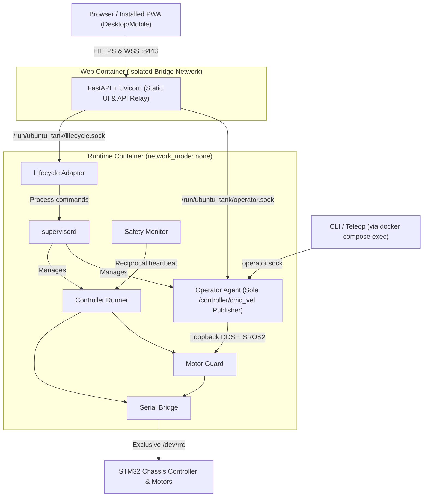
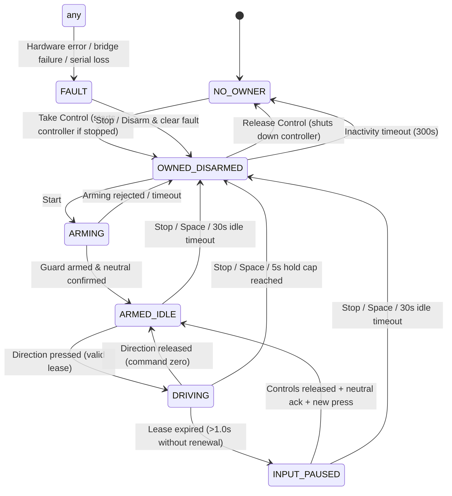

# MentorPi Tank Ubuntu Controller Design

This document defines the production design for the MentorPi Tank controller on
Raspberry Pi 5 running Ubuntu 26.04 ARM64 with ROS 2 Lyrical. The system delivers
motor control, safety supervision, and an HTTPS web/PWA interface through paired
Docker containers managed by Docker Compose.

---

## 1. System Architecture

The application is split into two ARM64 containers sharing an ephemeral Unix-socket
volume on the Pi host:

1. **Runtime Container:** Runs ROS 2, controller nodes, motor safety guard, serial
   bridge to `/dev/rrc`, operator agent, supervisord, and lifecycle adapter.
2. **Web Container:** Runs FastAPI/Uvicorn, serves compiled Vue 3/PWA assets,
   terminates TLS on port 8443, and relays WebSocket/HTTP requests to runtime sockets.



### Core Architecture Principles

- **Exclusive Device Ownership:** Only the runtime container maps `/dev/rrc`. It holds
  a host lifetime lock preventing competing instances.
- **Network Confinement:** Runtime uses `network_mode: none`. All ROS 2 DDS communication
  is restricted to loopback with SROS2 security enclaves. Web uses an isolated Docker bridge
  publishing port 8443 only.
- **Privilege Separation:** Web has no ROS libraries, no SROS2 private keys, no serial access,
  and no container socket. Both containers run as non-root UID `10001` (`ubuntu_tank`) with
  read-only root filesystems, dropped capabilities, and `no-new-privileges`.
- **IPC over Host-Mounted tmpfs:** `/run/ubuntu_tank-container/ipc` on host `/run` is
  bind-mounted to `/run/ubuntu_tank` in both containers (read/write for runtime, read-only
  for web). Sockets are cleared across reboots and never stored in persistent state.
  Runtime-internal heartbeat sockets use a private tmpfs (`/run/ubuntu_tank-private`).

---

## 2. Codebase Structure

The application code resides under `ubuntu_tank/` and deployment tooling under `docker/ubuntu_tank/`:

```text
mentorpi/
├── docker/ubuntu_tank/              # Container build and host management
│   ├── Dockerfile                   # Multi-stage ARM64 build (Node + ROS 2)
│   ├── compose.yaml                 # Compose service definitions for runtime & web
│   ├── supervisord.conf             # Process supervisor configuration for runtime
│   ├── build.py                     # Workstation image builder & manifest generator
│   ├── deploy.sh                    # Workstation deployment wrapper (SSH/rsync)
│   ├── install.py                   # Pi-side host installer & lifecycle manager
│   ├── image_identity.py            # Image digest & manifest validation helpers
│   ├── tls_setup.py                 # Host TLS certificate provisioning
│   └── ubuntu-tank-container.service# Systemd unit for host auto-start
│
├── ubuntu_tank/
│   ├── config/                      # Host-mountable configuration
│   │   ├── controller.yaml          # Motor speeds, kinematics, acceleration limits
│   │   ├── web/web.yaml             # Web ports, origins, lease & timeout limits
│   │   ├── fastdds/loopback.xml     # DDS loopback transport profile
│   │   └── sros2/                   # SROS2 governance, permissions, and policy
│   │
│   ├── src/                         # Application packages
│   │   ├── ubuntu_tank_protocol/    # ROS-free shared package: schemas, enums, IPC client
│   │   ├── ubuntu_tank_web/         # FastAPI backend, static file serving, socket relay
│   │   ├── ubuntu_tank_operator/    # Operator agent, lease management, cmd_vel publisher
│   │   ├── ubuntu_tank_supervisor/  # Runtime supervisor, safety monitoring, heartbeats
│   │   ├── ubuntu_tank_safety/      # Motor safety guard node (limits & watchdog)
│   │   ├── ros_robot_controller/    # Serial communication bridge to STM32
│   │   ├── ros_robot_controller_msgs/ # ROS message & service definitions
│   │   ├── controller/              # Chassis kinematics & Twist conversion
│   │   ├── ubuntu_tank_bringup/     # Launch files and runtime orchestration
│   │   └── ubuntu_tank_teleop/      # Terminal teleoperation client (via IPC)
│   │
│   └── web/                         # Vue 3 + TypeScript PWA frontend
│       ├── src/                     # App.vue, components, composables, API client
│       ├── public/                  # Manifest, icons, static assets
│       └── package.json             # Vite, Vue, vite-plugin-pwa dependencies
```

### Module Responsibilities

| Package | Environment | Responsibilities |
|---|---|---|
| `ubuntu_tank_protocol` | Web & Runtime | Shared Pydantic schemas, error definitions, wire types, constants, and Unix-socket client. Completely free of ROS dependencies. |
| `ubuntu_tank_web` | Web Container | Serves PWA bundle, handles TLS on port 8443, enforces CORS origins, exposes `/api/v1/` routes, relays operator/lifecycle socket requests. |
| `ubuntu_tank_operator` | Runtime Container | Arbitrates single-operator slot, manages lease timing and input pause/recovery, publishes `/controller/cmd_vel`, invokes guard Arm/Disarm. |
| `ubuntu_tank_supervisor` | Runtime Container | Monitors child processes (guard, bridge, agent, runner), runs lifecycle socket server (`/run/ubuntu_tank/lifecycle.sock`), enforces graceful shutdown. |
| `ubuntu_tank_safety` | Runtime Container | Intercepts Twist commands, applies velocity/acceleration clipping, verifies arming status, enforces command timeout zeroing. |
| `ros_robot_controller` | Runtime Container | Bridges `/ros_robot_controller/set_motor` to serial protocol on `/dev/rrc`. Reads battery voltage and motor telemetry. |
| `web` (PWA) | Browser Client | Responsive UI for Take/Release, Start/Stop, keyboard (W/S/A/D/Space) and pointer controls, status polling, and service worker caching. |

---

## 3. Operator Interface & Safety Contract

### 3.1 Operator State Machine

Control transitions through discrete states:



### 3.2 Control Operations

- **Take Control (`POST /api/v1/control/acquire`):** Starts the controller service via
  lifecycle adapter if inactive, verifies readiness, and binds the single operator session.
  Leaves the robot disarmed. Rejects competing clients.
- **Start (`POST /api/v1/control/start`):** Arms the controller. Requires healthy preflight,
  active ownership, valid battery, and neutral inputs. Movement is never commanded
  automatically; requires a subsequent direction press.
- **Drive (Direction Press-and-Hold):** Supports W/S/A/D keyboard keys and on-screen
  buttons. Single active direction at a time (no diagonals). Releasing direction
  immediately commands zero velocity while remaining armed.
- **Stop (`POST /api/v1/control/stop` or Space):** Immediately zeroes velocity and disarms
  the guard. Retains ownership and keeps the controller running. Space has top priority
  from any focused element on the page.
- **Release Control (`POST /api/v1/control/release`):** Zeroes velocity, disarms guard,
  shuts down the controller, and relinquishes ownership.

### 3.3 Safety Watchdogs & Timing Bounds

| Watchdog / Boundary | Timeout | Behavior on Expiry |
|---|---|---|
| **Input Lease** (`lease_duration_sec`) | `1.0 s` | Zeroes velocity immediately, enters `INPUT_PAUSED`. Guard remains armed. Requires physical control release, neutral challenge/ack handshake, and a fresh press to resume. |
| **Armed Idle Disarm** | `30.0 s` | Disarms guard; transitions to `OWNED_DISARMED`. Requires explicit Start to re-arm. |
| **Continuous Hold Cap** | `5.0 s` | Zeroes velocity and disarms; prevents sustained runaway if a key or pointer sticks. |
| **Ownership Inactivity** (`control_idle_timeout_sec`) | `300.0 s` (5 min) | Automatically executes Release Control: zeroes, disarms, shuts down controller, releases ownership. Polling/heartbeats do not reset timer. |
| **Browser Blur / Tab Hide** | Immediate | Commands stop and disarm. Background time accrues toward ownership inactivity. |
| **Transport Loss / Disconnect** | Immediate | Commands stop and disarm. Server-side disconnect clears owner slot. Reconnection never auto-resumes. |
| **Safety Monitor Heartbeat** | `500 ms` | Supervisor kills controller group if runner, guard, or bridge hangs. |
| **STM32 Hardware Watchdog** | `1000 ms` (typ. 280 ms) | Chassis firmware cuts motor power independently if serial frames stop arriving from Linux. |

---

## 4. Build, Packaging, and Release

### 4.1 Multi-Stage Image Build

Builds are executed on the development workstation via `docker/ubuntu_tank/build.py`,
targeting `linux/arm64`:

1. **Stage 1 (Frontend Builder):** Compiles Vue 3 PWA using Node.js and committed
   `package-lock.json` (`npm ci && npm run build`). Output: `ubuntu_tank/web/dist/`.
2. **Stage 2 (ROS 2 Builder):** Installs pinned APT and rosdep dependencies, builds
   ROS 2 packages with `colcon build --merge-install` under prefix `/opt/ubuntu_tank/current`.
3. **Target `runtime`:** Copies compiled ROS 2 install tree, Supervisor config, FastDDS
   profile, and entrypoint scripts onto base ROS 2 image.
4. **Target `web`:** Copies compiled static PWA assets, Python packages (`ubuntu_tank_protocol`,
   `ubuntu_tank_web`), and entrypoint scripts onto minimal Python base image.

### 4.2 Release Manifest & Identity

`build.py` produces an immutable release directory containing:
- `runtime.tar` and `web.tar` (exported ARM64 OCI image archives).
- `release.json`: Release manifest recording release ID, source Git commit hash, image
  config digests, schema versions, protocol version (`3.0.0`), and build timestamp.
- Deployments reference images by their exact sha256 digest, never mutable tags like `:latest`.

---

## 5. Deployment & Target Management

Deployment to the Raspberry Pi is managed via SSH by the development workstation script
`docker/ubuntu_tank/deploy.sh` and executed locally on the Pi by `docker/ubuntu_tank/install.py`.

### 5.1 Host Setup & Persistent Filesystem

The Pi host provides Docker Engine, udev rules, and persistent configuration directories:

```text
/etc/opt/ubuntu_tank/              # Persistent host configuration (preserved across updates)
├── controller.yaml                # Calibrated kinematics & speed caps
├── web/web.yaml                   # HTTPS listen address, allowed origins, timeouts
├── web/certs/                     # TLS certificate & private key (server.crt, server.key)
└── security/keystore/             # SROS2 governance, CA certificates, and signed enclaves

/var/opt/ubuntu_tank/              # Persistent host data
└── ros-log/                       # Controller and ROS log output

/run/ubuntu_tank-container/ipc/    # Ephemeral shared IPC directory (mode 0700, UID 10001)
├── operator.sock                  # Operator agent IPC socket (mode 0600)
└── lifecycle.sock                 # Lifecycle adapter IPC socket (mode 0600)

/etc/udev/rules.d/99-mentorpi-rrc.rules # Binds STM32 USB serial to /dev/rrc (group dialout)
/etc/systemd/system/ubuntu-tank-container.service # Systemd service managing Compose lifecycle
```

### 5.2 Deployment Workflow

To deploy a release to the Pi:

```bash
# 1. From workstation: build, package, transfer, and deploy
./docker/ubuntu_tank/deploy.sh user@ROBOT_IP

# Alternatively, reuse an existing build directory:
./docker/ubuntu_tank/deploy.sh user@ROBOT_IP --build-dir /path/to/build_output
```

The automated pipeline performs:
1. **Build & Smoke Test:** Builds both ARM64 images via Docker Buildx, exports tarballs,
   and verifies manifest hashes.
2. **Transfer:** Rsyncs image archives, release manifest, and host scripts to `~/mentorpi-releases/` on the Pi.
3. **Stop & Verification:** Gracefully stops active containers, ensures `/dev/rrc` is released.
4. **Host Preparation (`install.py prepare-host`):** Updates udev rules, creates runtime/config
   directories, sets up systemd service.
5. **Staging (`install.py stage`):** Loads Docker images from tar archives, verifies digests.
6. **Atomic Replacement (`install.py deploy`):** Under a host deployment lock:
   - Updates Compose configuration with new pinned image digests.
   - Starts containers with `docker compose up -d`.
   - Starts with controller stopped and disarmed.
7. **Verification (`install.py target-test`):** Confirms both containers are healthy, sockets
   are responsive, HTTPS endpoints respond, controller is inactive, and no motion is armed.

### 5.3 Rollback & Recovery

- **Redeployment:** In the event of a failed update, re-run `deploy.sh` with the previous
  known-good build directory.
- **Git Fallback:** If code changes must be reverted, check out the target Git commit,
  rebuild the release using `build.py`, and run `deploy.sh`.
- **Clock / TLS Failure Recovery:** If the Pi boots without RTC battery and clock is reset
  prior to TLS certificate validity date, synchronize system time via NTP (`sudo chronyc -a makestep`
  or `sudo systemctl restart systemd-timesyncd`), then restart the container service:
  ```bash
  sudo systemctl restart ubuntu-tank-container.service
  ```
