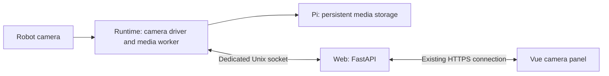

# Ubuntu Tank Camera Design

Status: proposed; implementation has not started.

Extend the existing `ubuntu_tank` web console with live camera video, JPEG
capture, and video recording. Keep the existing paired runtime/web containers
and motion-control behavior described in [DESIGN.md](DESIGN.md).

## 1. UI first

The first milestone is a **no-op web UI for owner review**. It must be usable
without the Pi, camera, backend, or motion-control connection. Do not implement
camera integration until the owner approves the UI.

Place the camera beside the drive controls on desktop and above them on narrow
screens. Preserve ready access to the robot's motion Stop.

```text
┌────────────────────────────────────────┐
│ Camera                        ● Live   │
│                                        │
│              Live preview              │
│                                        │
│ [ Capture ]          [ Record ]        │
│                                        │
│ Latest image / video: Download         │
└────────────────────────────────────────┘
```

The camera panel has exactly two action buttons:

| Button | Production behavior |
| --- | --- |
| Capture | Save a fresh JPEG on the Pi and show a download link. Works during recording. |
| Record / Stop recording | Start one recording; change to Stop recording after confirmation. Stop finishes the file and offers a download link. |

During recording, show a red indicator and elapsed time. Use “Stop recording”
to distinguish this action from the robot's motion Stop. Downloads are links,
not additional camera action buttons.

Show connecting, live, unavailable, recording, finalizing, and error states.
Disable Capture and Record when frames are stale. Keep Stop recording available
while a recording is active, even if the camera loses frames. Show a pending
state while a request is in progress and explicit success or failure afterward.

In the no-op milestone, use a bundled placeholder and local component state.
Capture displays “Preview only — no image saved.” Record starts a simulated
timer; Stop recording ends it without creating a file. Mark the panel “UI
preview — camera disconnected.” Any example download link is disabled and
identified as an example. Provide review fixtures for unavailable, pending,
finalizing, and error states without adding production action buttons.

## 2. Runtime architecture

The current Ubuntu deployment has Vue/FastAPI web control but no camera service
or camera device mapping. Vendor reference launch files contain several camera
drivers; the installed camera model and compatible driver must be verified.



- Runtime owns the camera device, driver, capture, and recording. Web remains
  ROS-free and has no hardware access.
- Run media work separately from controller and safety processes. Its lifecycle
  is independent of Take control, Start, Stop, and Release control.
- Use a dedicated `/run/ubuntu_tank/camera.sock`; never send image payloads over
  `operator.sock` or `lifecycle.sock`. Define bounded media messages and timeouts
  separately from the existing small control-message limits.
- Preserve runtime `network_mode: none`, non-root execution, and restricted
  device access. Determine camera-specific device rules on the Pi; do not add
  privileged mode or a blanket `/dev` mount.
- If the selected driver uses ROS, give it narrowly scoped SROS2 permissions
  and loopback DDS configuration. Camera processes must not publish motion commands.
- Keep camera failures distinct from controller supervision failures. Changes
  to Supervisor registration and failure handling must preserve existing motor
  safety responses.

Use MJPEG over the existing HTTPS origin for the initial preview. Propose
640 × 480 at 15 fps as the starting profile, subject to camera support and Pi
measurements. Open the camera while preview clients or recording need frames;
release it after an idle timeout. Share one acquisition pipeline across viewers.

Use bounded latest-frame queues: slow viewers drop old frames instead of
accumulating delayed video. Report frame freshness independently of whether the
HTTP connection remains open. Mark frozen imagery stale and disable new saves.

## 3. Capture, recording, and storage

Capture saves a frame acquired after the request, within a bounded timeout;
failure to obtain a fresh frame returns an error. Save atomically and return a
server-generated media ID, timestamp, and download URL.

Record on the Pi, with one active recording shared across tabs. Use an
H.264/MP4 encoder validated on the Pi; hardware acceleration is not assumed.
Write fragmented MP4 during recording to improve interruption recovery, then
publish the completed download after successful finalization. Fragmentation
does not guarantee recovery of unwritten data. See the
[FFmpeg format documentation](https://www.ffmpeg.org/ffmpeg-formats.html#mov_002c-mp4_002c-ismv).

Recording continues through browser refresh, hidden tabs, and network loss.
Reconnecting clients retrieve server state rather than starting a new recording.
Camera loss, encoder failure, duration limits, or low storage end recording with
an explicit reason. Preserve recoverable footage and identify interrupted files.
After a process or Pi restart, never automatically resume recording.

Store files under `/var/opt/ubuntu_tank/media`, writable only by the runtime
service. Web streams downloads through media IPC; it does not need a writable
storage mount. Use opaque IDs rather than client-provided paths. Keep a bounded
index so completed files remain discoverable after reload or restart.

Configure resolution, frame rate, JPEG quality, bitrate, freshness timeout,
maximum recording duration, storage quota, minimum free space, and maximum
viewers/downloads. Validate ranges and resource budgets before enabling the
feature. Reject new saves at the storage limit; finalize active recordings before
the free-space reserve is exhausted. Do not silently delete existing media.
Document owner cleanup commands before deployment; a media-management UI is
outside this feature's initial scope.

## 4. API contract

All routes use the existing `/api/v1` namespace and HTTPS origin. Camera actions
do not acquire motion ownership or renew motion-input leases. Apply existing
origin validation to mutations. Do not expose a new public camera port.

| Method and route | Contract |
| --- | --- |
| `GET /camera/status` | Camera state, frame age, recording ID/state, elapsed time, storage availability, and last error. |
| `GET /camera/stream` | Bounded MJPEG stream; disconnect releases the viewer subscription. |
| `POST /camera/captures` | Save a fresh JPEG; return media metadata or a freshness/storage error. |
| `POST /camera/recordings` | Start a recording; return its ID and state. |
| `POST /camera/recordings/{id}/stop` | Idempotently request finalization; return current state. |
| `GET /camera/media` | Paginated saved-media metadata, including completion/interruption state. |
| `GET /camera/media/{id}` | Download saved media by ID; reject unknown IDs or unavailable files. |

Capture and recording-start requests carry idempotency keys. Serialize recording
transitions so concurrent tabs cannot create competing encoders. An active
recording conflict returns its current ID; a delayed Stop for an old ID cannot
stop a newer recording. Poll status through starting, recording, finalizing, and
completed/failed states. Do not claim success based solely on a button click.

Use structured errors for unavailable camera, stale frames, recording conflict,
low storage, and worker failure. Document exact schemas, status codes, request
limits, and retry behavior alongside implementation. Generate OpenAPI and frontend
types through the existing protocol workflow.

Exclude camera API responses, streams, and downloads from PWA caching. Bound
encoding concurrency and download bandwidth so media work cannot monopolize web
workers or delay control traffic. Camera UI focus and shortcuts must preserve
the existing Space-to-stop and focus-loss behavior.

## 5. Milestones

Milestone completion requires its listed evidence. Local tests do not establish
real-camera compatibility or motor-stop timing.

### CAM-1 — No-op web UI and owner review

Deliver a `CameraPanel.vue` integrated into the existing console layout and a
local review mode that needs no backend. Include the placeholder, two buttons,
simulated recording timer, feedback, and review fixtures from section 1.

No camera API calls, device access, encoder, saved files, container changes, or
robot operations are part of this milestone. Existing driving controls must be
inert in standalone review mode. Normal console behavior remains unchanged.

Acceptance:

- Provide a reproducible local preview command and review URL.
- Verify desktop and narrow layouts, keyboard access, button transitions, and
  separation from motion Stop. Confirm the preview makes no robot requests.
- Let the owner review placement, size, labels, and interactions; revise the
  mockup until approved.
- **Gate: do not start CAM-2 or backend/hardware integration until the owner
  explicitly approves the UI.** CAM-1 is not complete merely because it builds.

### CAM-2 — Camera discovery and live preview

Verify the actual camera and driver on the Pi 5. Add the runtime camera worker,
restricted device access, media IPC, status/stream API, and production UI binding.
Retain local preview fixtures for development. Capture and Record stay disabled
with a clear unavailable state until their milestones are implemented.

Acceptance:

- Verify real images over existing HTTPS while the controller is stopped,
  disarmed, and ownerless.
- Record supported profiles and measured frame rate, latency, CPU, and memory.
- Verify stale frames, unplug/reconnect behavior, slow viewers, and browser
  reconnect without unbounded queues or implicit robot startup.

### CAM-3 — Image capture and persistent downloads

Implement fresh-frame capture, atomic JPEG storage, media listing, and download
links. Add quota/free-space enforcement and documented cleanup procedures.

Acceptance:

- Open downloaded JPEGs from the real camera; verify saved media survives restart.
- Test stale-camera rejection, repeated requests, concurrent captures, write
  failures, unknown media IDs, and low-storage errors through public behavior.
- Confirm Capture never changes robot ownership, arming, or motion state.

### CAM-4 — Recording and recovery

Implement the encoder, server-owned recording state, timer, Stop recording,
finalization, and MP4 downloads. Enforce duration and storage limits.

Acceptance:

- Play a completed real-camera recording in the supported Windows Chrome client.
- Capture an image during recording without interrupting the video.
- Verify refresh, multiple tabs, network loss, duplicate Start/Stop requests,
  stale recording IDs, camera loss, encoder failure, and storage limits.
- Verify bounded shutdown and interrupted-file recovery on worker/container/Pi
  restart. Record any lost footage; never silently label partial files complete.

### CAM-5 — Pi integration, safety validation, and handoff

Complete ARM64 packaging, dependency/provenance records, host provisioning,
configuration documentation, and explicit real-Pi integration checks. Installation
and deployment tests run production scripts on the Pi, not workstation simulations.

Acceptance:

- Run applicable local product/browser tests and real-Pi installation checks.
- With separately authorized raised-track tests, verify motion Stop, focus loss,
  input expiry, and disconnect behavior under concurrent preview, recording,
  capture, and download load. Measure against existing stop requirements.
- Record resource limits, camera recovery behavior, playback evidence, and all
  pending or waived checks. Previous controller acceptance does not certify this
  new media workload.
- Update operator/deployment documentation and release evidence. End deployment
  stopped, disarmed, and ownerless. On-ground motion remains outside scope.

## 6. Expected code changes

| Area | Purpose |
| --- | --- |
| `ubuntu_tank/web/src/App.vue` and new camera component/composable | Panel layout, local review mode, and later server-backed media state. |
| `ubuntu_tank/src/ubuntu_tank_web/` | Camera routes, bounded IPC relay, streaming, and downloads. |
| `ubuntu_tank/src/ubuntu_tank_protocol/` | ROS-free camera contracts, validation, and client support. |
| New `ubuntu_tank/src/ubuntu_tank_camera/` | Camera adapter, frame distribution, storage, and encoder lifecycle. |
| `ubuntu_tank/config/` | Validated camera settings and required ROS security permissions. |
| `docker/ubuntu_tank/` | Dependencies, camera device access, Supervisor integration, storage provisioning, and Pi verification. |
| Product/browser tests and operator documentation | Observable behavior, recovery procedures, and validation evidence. |

Driver selection, device mapping, codec performance, and final resource limits
remain open until CAM-2 measurements. Audio, depth visualization, camera steering,
cloud upload, and mobile physical acceptance are outside the initial scope.
