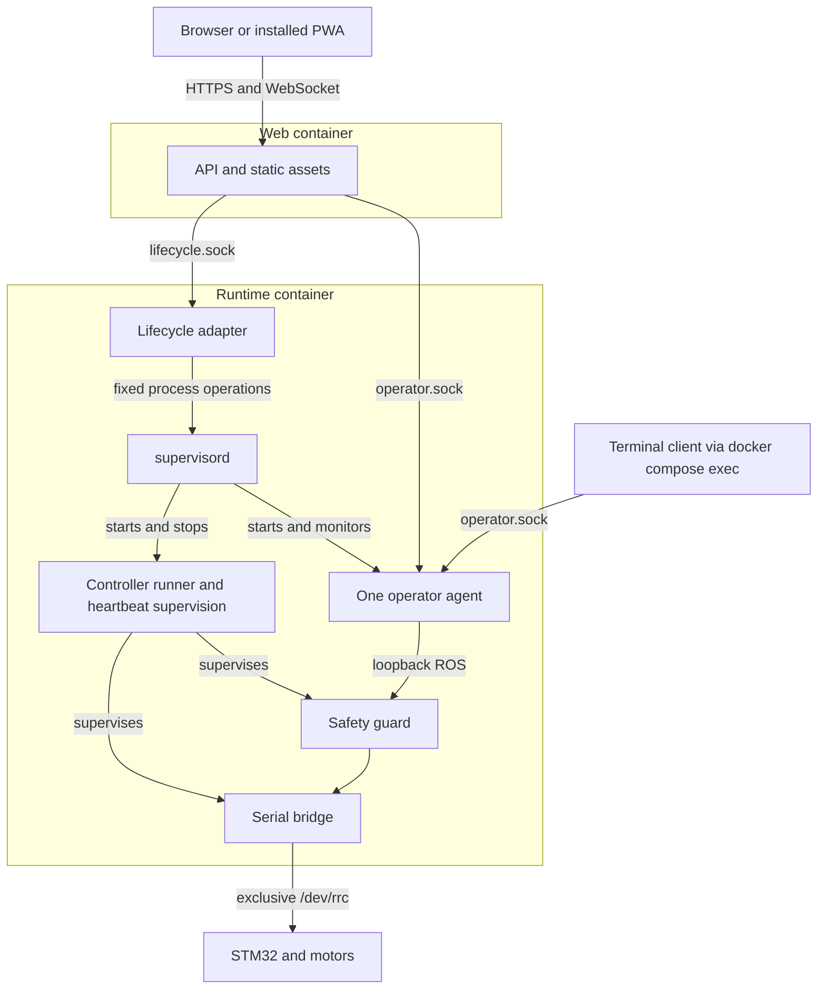

# MentorPi Ubuntu Tank Container Refactor

Status: C1–C4 implemented. C4 owner-scoped Pi deployment, redeployment, reboot and power-on verification passed; other C4 fault tests were waived, not passed. M15 supplies owner-scoped C5 evidence; instrumented physical acceptance remains waived. C6/M16 handoff and native-path cleanup are complete; current service and recovery restrictions remain in the handoff.
Date: 2026-10-03.

## 1. Purpose and scope

Package the current `ubuntu_tank` application into two ARM64 images deployed
together with Docker Compose on the Ubuntu Pi 5:

1. **Runtime:** ROS 2, controller, safety guard, serial bridge, supervision,
   operator agent, and restricted controller lifecycle service.
2. **Web:** HTTPS API, WebSocket relay, and compiled Vue/PWA assets.

Preserve the existing motion and operator contracts while separating application
delivery from host ROS installation. The Pi still supplies its kernel, USB
drivers, device rules, Docker Engine, and boot/shutdown integration. Initial
support remains Ubuntu 26.04 ARM64 with ROS 2 Lyrical inside the runtime image;
changing the Pi operating system is a separate project.

Docker replaces native application deployment for the fresh controller.
`docker/customization/` and `docker/original/` remain separate. Camera, LiDAR,
navigation, vendor applications, and model assets are outside this refactor.
After migration, maintain only Docker deployment; section 7 defines the Git fallback.

Related contracts:

- [Fresh controller design](MENTORPI_FRESH_CONTROLLER_DESIGN.md): guarded motor
  commands, serial ownership, watchdogs, and physical acceptance.
- [Web control design](MENTORPI_WEB_CONTROL_DESIGN.md): shared operator authority,
  lifecycle operations, leases, browser/PWA behavior, and stop timing.
- [Current deployment guide](../ubuntu_tank/README.md), to be updated for Docker.
- [Web dependencies and protocol](../ubuntu_tank/docs/WEB_DEPENDENCY_CLOSURE.md).

## 2. Deployment architecture

Only the runtime container receives `/dev/rrc`. All ROS processes share its PID
and network namespaces, preserving loopback DDS discovery and local heartbeat
PID checks. Keep the current SROS2 enclave permissions and guarded topic path.
The web container contains no ROS runtime or SROS2 private keys.

Use `network_mode: none` for runtime, subject to real DDS validation on its
loopback interface. Web uses an ordinary isolated bridge network and publishes
HTTPS only. Neither container requires host networking, host PID namespace,
privileged mode, a Docker socket, or host systemd/D-Bus access.

Run exactly one runtime instance and one web worker. Scaling the runtime is
invalid; multiple web workers require a separate review of connection ownership
and relay state. Terminal access executes the existing IPC client inside the
runtime container without creating another long-running container or ROS
authority. The normal CLI must not use its direct-ROS diagnostic escape path.

## 3. Inter-container communication and filesystem contracts

### 3.1 Two existing sockets

Preserve the existing request framing, bounded messages, error responses, and
protocol/version checks:

| Socket in both containers | Server | Purpose |
|---|---|---|
| `/run/ubuntu_tank/operator.sock` | Operator agent | Ownership, arming, control, stop, telemetry |
| `/run/ubuntu_tank/lifecycle.sock` | Lifecycle adapter | Fixed controller start, stop, status, bounded logs |

Share the directory, not individual socket files: servers must be able to
replace their sockets after restarting. Web reconnects with backoff and reports
unavailable status while a server is absent. Reconnection never restores
ownership, arming, challenges, or queued motion. Protocol mismatch disables
control with a clear version error.

Use a host-prepared ephemeral directory at
`/run/ubuntu_tank-container/ipc`, bind-mounted to `/run/ubuntu_tank` in both
containers. This is the concrete shared-volume implementation: host `/run`
clears it on reboot and avoids storing sockets in persistent application state.
Runtime mounts it read/write; web mounts it read-only and connects to existing
sockets. Verify Unix socket connection behavior on that mount in the real Pi
integration suite. Runtime-private heartbeat sockets, PID files, and supervision
state move to `/run/ubuntu_tank-private`, a private tmpfs, never shared with web.

### 3.2 Identities and ownership

For this trusted personal robot, run both containers with the same fixed non-root
application UID. Use that UID for the shared socket directory (`0700`) and sockets
(`0600`), and reuse existing same-UID connection checks. Only runtime receives
access to `/dev/rrc`. Initially support standard rootful Docker without
user-namespace remapping. Preserve existing SROS2 policy and all motion safeguards,
including exclusive control, arming, leases, watchdogs, and fail-closed stopping.

### 3.3 Persistent and immutable data

| Data | Runtime | Web | Lifetime |
|---|---|---|---|
| Installed code at `/opt/ubuntu_tank/current` | Image | Image | Immutable image release |
| Controller configuration | Read-only | Not mounted | Preserve across image updates |
| Web configuration | Shared control limits as needed | Read-only | Preserve across image updates |
| SROS2 keystore | Read-only | Not mounted | Preserve across image updates |
| HTTPS certificate/key | Not mounted | Read-only | Preserve across image updates |
| ROS logs at `/var/opt/ubuntu_tank/ros-log` | Writable mount | Not mounted | Retain with bounded rotation |
| IPC directory | Read/write | Read-only | Ephemeral; no sessions persisted |
| Private run directory and `/tmp` | tmpfs | Separate tmpfs | Container lifetime |

Retain existing configuration and state formats; record existing versions where
available. Preserve configuration, keys, certificates, logs, and acceptance reports
on the host. Ownership, leases, and arming state remain ephemeral.

Use read-only image filesystems, dropped capabilities, and no-new-privileges.
Pre-create writable directories on the host; do not start application containers
as root merely to fix ownership. Never bake certificates, private keys, active
leases, or host-specific state into an image. Disable runtime bytecode writes.

## 4. Refactoring the code

**Reuse rule:** Prefer existing mature tools and repository code whenever feasible.
Add custom code only for robot-specific behavior that those tools do not provide.

### 4.1 Extract a ROS-independent protocol package

Create `ubuntu_tank/src/ubuntu_tank_protocol/` as an installable Python package
holding shared schemas, constants, enums, web configuration validation, IPC
client code, lifecycle wire definitions, and API artifact generation.

Currently web imports these through `ubuntu_tank_operator`, whose `__init__.py`
also imports agent/server implementation. `lifecycle_client.py` imports constants
from the lifecycle service implementation. Remove these dependencies so web
imports and executes normally with ROS entirely absent, not merely hidden by
optional-import fallbacks.

Update all consumers directly to the new package; no compatibility re-exports
are needed. Move declarations without duplicating schemas or changing wire
semantics.
Generate OpenAPI and TypeScript from the shared contract and compare generated
artifacts through the existing generation workflow. Keep state-machine and ROS
authority implementation in the runtime packages.

### 4.2 Replace systemd lifecycle operations

Keep the same Start, Stop, Status, and Logs requests, and move their handling from
`ubuntu_tank_web/lifecycle_service.py` into a small runtime lifecycle service.
Replace `systemctl` and `journalctl` with calls to `supervisord` and bounded log
retrieval. One implementation is sufficient; no backend-selection abstraction
is needed. Start leaves the controller disarmed, and Stop cancels pending starts
without waiting for deployment locks. Preserve existing validation and limits.

### 4.3 Reuse existing process-management tools

Use `supervisord` inside runtime for process start/stop, exit monitoring, and logs,
with Compose `init: true` for signal forwarding and child reaping. Configure
the controller with `autostart=false` and `autorestart=false`; browser Start/Stop
controls it through the lifecycle service while the operator stays available.
See [Supervisor configuration](https://supervisord.org/configuration.html).

Disable automatic restart of required robot processes. Configure group shutdown
and route process-exit events to the safety handling in section 4.4. Every
container restart leaves the controller stopped, disarmed, and without an owner.

### 4.4 Preserve robot safety supervision

Adapt `mentorpi-tank-run` and the existing robot supervisor instead of adding a
general-purpose manager. Replace systemd notifications with explicit fault
handling. Keep the safety monitor in a separate process from the lifecycle adapter
and controller runner, so it can act when either hangs.

| Watched component | Monitor and deadline | Failure action |
|---|---|---|
| Guard and bridge | Controller runner; existing configured heartbeat deadlines | Stop/disarm and terminate controller group |
| Operator agent | Existing downstream command freshness checks; safety monitor checks agent progress | Stop/disarm; require fresh Start and Arm |
| Controller runner and lifecycle adapter | Safety monitor; bounded progress checks | Signal controller group directly, without waiting for lifecycle requests |
| supervisord | Safety monitor; bounded local control-API probe | Stop controller directly; terminate runtime for Docker recovery |
| Safety monitor | Controller runner; reciprocal progress heartbeat while controller runs | Stop/disarm and exit controller group |
| Entire runtime frozen | STM32 firmware watchdog | Stop motors independently of Linux |

C2 defines 500 ms progress deadlines, a 50 ms poll interval, a 200 ms local
Supervisor API timeout, a 10 s startup allowance, and 500 ms group cleanup.
See [C2 supervision](../ubuntu_tank/docs/CONTAINER_SUPERVISION.md) for detection
latency, shutdown behavior and reproducible process tests. Heartbeats must come from the event loop being monitored.
Keep existing command deadlines and physical-stop bounds; monitoring timeouts
are not substitutes for those bounds. Recovery requires explicit Start and Arm.

On shutdown, reject new commands, request zero/disarm, and terminate the complete
controller process group within a bounded time, even if the operator is hung.
Keep existing motion limits, serial-fault handling, and the STM32 watchdog.
Docker health checks report status; they do not enforce motor-stop timing.

### 4.5 Preserve web and terminal behavior

Update web imports to the shared package and keep `operator_relay.py` and
`lifecycle_client.py` as socket clients. Serve the compiled frontend with the
existing API service; no separate Nginx container is required. Container web
configuration must bind `0.0.0.0:8443`; the current loopback default would not
serve a published port. Preserve strict configured browser origins, HTTPS/PWA
behavior, and the single-owner model without adding login/accounts.

Provision TLS outside normal startup and refactor `ensure_tls_certificate`
usage so production container startup validates mounted certificates and fails
clearly if absent/invalid. It must not silently replace the Pi's identity.

The terminal command executes the installed IPC client in runtime. Preserve
browser/terminal mutual exclusion and emergency Stop access. Web restart or PWA
update invalidates its control connection, stops/disarms, and requires fresh
ownership and arming. Preserve the build-A to waiting-build-B safe update flow.

### 4.6 File responsibility map

Paths below are relative to `ubuntu_tank/` unless prefixed with `docker/`.

| Existing or proposed artifact | Change |
|---|---|
| `src/ubuntu_tank_operator/ubuntu_tank_operator/{constants,enums,schemas,config,ipc_client}.py` | Extract shared contract/client code and update all imports |
| `src/ubuntu_tank_protocol/` (new) | ROS-free protocol, lifecycle wire types, version/artifact generation |
| `src/ubuntu_tank_operator/ubuntu_tank_operator/{__init__,ipc_server,entrypoint,agent_node}.py` | Shared imports, same-UID sockets, progress reporting, controller restart handling |
| `src/ubuntu_tank_web/ubuntu_tank_web/{lifecycle_service,lifecycle_client}.py` | Move server operations to runtime; retain web socket client |
| `src/ubuntu_tank_web/ubuntu_tank_web/{app,entrypoint,operator_relay,tls}.py` | Shared imports, container configuration, mounted TLS, fail-closed reconnect |
| `src/ubuntu_tank_runtime/` (new, if needed) | Thin lifecycle adapter to Supervisor and integration with existing robot safety supervision |
| `bin/mentorpi-tank-run` and `src/ubuntu_tank_supervisor/` | Container heartbeat/shutdown supervision replacing systemd notifications |
| `src/ubuntu_tank_bringup/launch/tank.launch.py` | Configurable private heartbeat/PID paths and managed process lifetime |
| `src/ubuntu_tank_teleop/`, `src/ubuntu_tank_bringup/ubuntu_tank_bringup/operator_client.py` | Installed container CLI path through the same operator |
| `scripts/{build_workspace.sh,prepare_build_root.py,build_disposable_root.sh}` | Reuse required build/closure logic in image builds; remove obsolete native root preparation |
| `scripts/deployment_manager.py`, host application units, native deployment commands | Replace native release activation/recovery with the Docker deployment script; remove obsolete application services and commands |
| Package `setup.py`/`package.xml`, dependency closure tools | Declare new package boundaries and image-specific dependency sets |
| `scripts/{target_test,web_acceptance}.py` | Verify Docker deployment and image/config-bound evidence; replace native ownership checks |
| `docker/ubuntu_tank/` (new) | Dockerfile, Compose, Supervisor configuration, build-context policy, host/deployment CLI, usage guide |

## 5. Image build and release model

Use one multistage Dockerfile with two final targets, `runtime` and `web`.
Frontend compilation uses `npm ci` with the committed lockfile in a Node builder.
ROS compilation runs in an ARM64 Ubuntu/ROS builder. Install the shared protocol
and web Python packages into web without pulling ROS into that image. Reuse
repository APT closure information; splitting dependencies must produce explicit
builder/runtime/web manifests, not silently substitute unpinned pip packages.

Build installed artifacts at their final `/opt/ubuntu_tank/current` prefix so
generated launchers and compiled libraries do not reference the build checkout.
Do not run native host installers, udev provisioning, EEPROM checks, or systemd
activation inside image layers. Image construction installs application/runtime
dependencies; target preparation stays on the host.

Pin base images by digest, record exact package versions/hashes and source
revision, preserve vendor licenses, and exclude disk images, private extracted
factory sources, `.venv`, `node_modules`, credentials, and unrelated reference
trees from the build context. Prefer an explicitly staged allowlist context.
Never copy a developer's `install/` tree as a production ARM64 build.

Produce one release manifest binding runtime digest, web digest, ARM64 platform,
source/build identity, dependency manifests, existing configuration/state versions,
and supported IPC versions. Deploy by digest. A tag such as `latest` is not the
release identity. The web/runtime pair is upgraded together by default.

Build natively on ARM64 where available. An x86 development computer can use
an ARM64 builder or emulation; emulated build success is not Pi timing evidence.
See [Docker multi-platform builds](https://docs.docker.com/build/building/multi-platform/).

## 6. Compose and host responsibilities

The proposed `docker/ubuntu_tank/compose.yaml` defines only `runtime` and `web`.
Use init/signal handling, explicit device mapping for runtime, read-only roots,
bounded log rotation, tmpfs run directories, and a measured shutdown grace period.
Start with a 5-second cleanup grace period, then validate it against actual child
cleanup; this is not the physical motor-stop allowance. Web publishes 8443.
See the [Compose service reference](https://docs.docker.com/reference/compose-file/services/).

Health has two levels: lifecycle/agent IPC readiness and controller readiness.
A deliberately stopped controller is a healthy runtime. Probe lifecycle status
and operator responsiveness without acquiring control or arming. Web remains
available to report runtime failure. Dependency startup ordering is only an aid;
every request must handle runtime disappearance.

Use `restart: unless-stopped` for container recovery, with every runtime start
returning to controller stopped. An unhealthy flag alone does not terminate a
process; the supervision code must enforce fault handling. Docker restart
behavior is distinct from application readiness and the watchdog contract.
See [Docker restart policies](https://docs.docker.com/engine/containers/start-containers-automatically/).

Host preparation is explicit and limited to Docker/Compose prerequisites, udev
and serial permissions, directory/account provisioning, deployment locks, and
boot/shutdown integration. It does not install ROS on the host. Keep host
shutdown sequencing capable of requesting graceful container stop before Docker
and storage disappear; validate actual reboot/shutdown behavior on the Pi.

Map only `/dev/rrc` and add its verified numeric device group to runtime. USB
disconnect/re-enumeration may invalidate the original device mapping. Initial
recovery is: fault and stop, verify the reappeared device on the host, recreate
runtime with the current mapping, then require explicit Start/Arm. Do not solve
hotplug with a broad `/dev` bind or privileged mode.

### 6.1 Exclusive hardware ownership

Run one runtime container. It holds a host-mounted hardware-owner lock for its
lifetime, including while the controller is stopped. Keep this separate from
the deployment lock and never replace its inode while held. The bridge should
also enforce exclusive serial open where supported and verified on the Pi.

Before first Docker deployment, stop and disable the old native application
services and verify that no process holds `/dev/rrc`. Record the host changes
needed to undo this cutover. Subsequent deployments check for conflicting
containers and device holders on the host; runtime checks its lock, config, and
device locally. Do not mount the Docker socket. A lock cannot exclude an old
process that does not use it, so verify actual device ownership as well.

## 7. Deployment, update, and Git fallback

Use `docker/ubuntu_tank/install.py` with system Python for Pi host operations;
no Pi virtual environment is required. Build images separately with
`docker/ubuntu_tank/build.py` using the development repository `.venv`.
These Python entrypoints replace native application deployment commands.
Operations and side effects:

| Command | Contract |
|---|---|
| `build.py --output DIR` | Build the two images and release manifest; never open hardware |
| `stage RELEASE` | Pull/load and verify both digests and configuration compatibility without changing running processes |
| `prepare-host` | Explicit host provisioning; report changes and recovery instructions |
| `deploy RELEASE` | Under the deployment lock, stop/disarm and verify old ownership release, replace the pair, verify new stopped/disarmed readiness |
| `status` / `logs` | Read observed state and bounded diagnostics without mutation |
| `stop` | Stop/disarm and shut down both containers; preserve persistent data |
| `target-test` | Verify an already built and deployed release on the real Pi; no implicit build/install |
| `web-acceptance` (planned C5) | Run explicit raised-track, image-bound physical acceptance |

Start/Stop controller remains available through browser and terminal; deployment
itself does not arm or start the controller. Document registry
pull/push and offline `docker image save`/`load` transport without embedding
registry credentials in manifests or images.

Updates are stop-and-replace, never rolling overlapping runtime replicas:

1. Stage and verify both image digests before interrupting the current release.
2. Acquire the deployment lock; block new Start/Arm while allowing Stop.
3. Stop/disarm, close browser control sessions, terminate old runtime, and verify
   its descendants/device handles are gone. Keep the transaction lock throughout.
4. Start the new pair with controller stopped and verify matching release IDs,
   protocol/config compatibility, and disarmed readiness before permitting Start.
5. If deployment fails or is interrupted, leave control unavailable and report
   the failure. Re-run deployment to finish installing a consistent pair; do not
   automatically restore or start an earlier controller. Startup must reject
   a mismatched pair even if Docker restarts containers after interruption.

Keep configuration and persistent-data formats unchanged for this packaging
refactor. Preserve existing configuration, certificates, and SROS2 keys outside
images; avoid adding migration journals, schema downgrade machinery, or an
automatic release rollback command.

To fall back: stop/disarm, shut down containers, verify serial ownership is
released, revert the migration changes in Git, and redeploy with the restored
tooling. Undo the recorded host-service changes and verify stopped/disarmed state.
Git restores code; these manual steps restore the running system.

## 8. Validation and acceptance

### 8.1 Development computer

Run existing product tests with the repository `.venv`, frontend type checking,
and browser tests. Add behavior tests for the extracted protocol, lifecycle
requests, real child-process shutdown, stale heartbeat failure,
start/stop races, connection loss, restart epochs, and bounded log handling.
Exercise the ROS-free web package in its built image. Test real runtime processes
with product-level test doubles where appropriate; do not simulate Pi installers.

Validate Dockerfile/Compose acceptance through the actual tools and image
entrypoints. Do not assert strings or parsed directives in handwritten YAML,
Dockerfiles, systemd units, or scripts. Generated release manifests may have
contract assertions.

### 8.2 Real Pi 5 installation and runtime integration

Refactor the explicit target suite to verify Docker deployment. Production
build, deployment, and verification remain separate operations.
Verify the actual installed result, including:

- Image architecture/digests, imported packages, read-only runtime, mounted
  configuration and TLS identity, and browser assets from the same release.
- Actual cross-container socket requests using the shared application UID,
  existing peer-check rejection behavior, owner-only socket permissions,
  reconnection after server recreation, private heartbeat isolation, and DDS.
- Single serial owner; rejection of competing native/container startup and
  recovery when `/dev/rrc` disappears/reappears.
- Browser/terminal arbitration, controller Start/Stop, hung-child handling,
  SIGTERM/SIGKILL, OOM recovery, CPU pressure, Docker daemon restart, and Pi reboot.
- Pair upgrade, interrupted deployment leaving control unavailable, successful
  redeployment, retained logs, and browser/PWA update from build A to build B.

Use Docker/container process identity plus the verified device holder in place
of hard-coded `mentorpi-tank.service` ownership checks. Reports bind both image
digests, config hashes, schema/protocol versions, host boot ID, and run identity.
Retain historical acceptance reports as evidence, not a second verification backend.

### 8.3 Real robot with elevated tracks

Repeat all relevant native and web physical acceptance cases, including four
directions, release/Stop/Disarm, lease expiration, browser/network loss, agent
failure, guard/bridge failure, serial loss, and host shutdown. Add runtime/web
container kill, pause, restart, supervisor hang, resource exhaustion, and update
interruption. Container pause is especially important: software watchdogs inside
that container cannot execute while frozen.

Use existing native/web timing bounds for matching faults. Keep the web target
of physical rest within 300 ms for browser/network/web loss with a healthy agent;
do not apply that assumption to a frozen whole runtime without measurement.
For new container-wide faults, explicitly map the final stopping mechanism and
approve a numeric acceptance bound before testing, using the existing firmware
watchdog ceiling as an upper constraint where it is the sole remaining path.
Never silently enlarge an existing bound to accommodate Docker.

Record event-to-agent, zero-write, and physical-rest measurements, raw instrument
evidence, and actual observer confirmation. Neither image builds nor serial
writes can mark physical acceptance passed. On-ground operation remains outside
this design's authorization.

## 9. Implementation sequence and completion gates

These phases are local to this document; existing milestone numbering is intact.

| Phase | Deliverable | Exit evidence |
|---|---|---|
| C1 (complete) | Shared protocol package | Installed protocol/web wheel test passes with runtime imports forbidden; generated OpenAPI/TypeScript unchanged; existing product and browser tests pass |
| C2 (complete) | Supervisor integration, lifecycle adapter, existing robot supervisor adaptation | Numeric monitor deadlines set; process tests cover each monitored failure, start/stop races, stopped boot |
| C3 (complete) | Two final image targets and Compose definition | Both ARM64 images build under emulation; installed CLI/import checks, HTTPS/static assets, shared IPC permissions and server replacement pass; web has no ROS |
| C4 (owner-scoped verification passed) | Host ownership and Docker deployment tooling | Pi deployment/redeployment, reboot and power-on passed; USB, competing-owner and interrupted-update tests waived by owner; manual Git fallback documented |
| C5 (owner-scoped evidence recorded) | Container-specific failure and physical campaign | M15 owner-observed stopping and fault results recorded; original instrumented stop-bound gate remains uncertified |
| C6 (complete) | Operator documentation and release handoff | M16 guide/evidence index, native-path cleanup, development checks and independent review complete |

For the current owner-scoped release, M15 supplies C5 evidence under the
[October 2 acceptance scope](M15_ACCEPTANCE_2026-10-02.md); the original C5
instrumented exit remains uncertified. Coordinate C6 with
[M16](MENTORPI_WEB_CONTROL_DESIGN.md#milestone-16--docker-operator-handoff-and-owner-scoped-release).
Carry forward excluded tests and waived timing/distance measurements without
requiring them again or marking them passed. Keep the boot-clock/TLS startup
failure and network limitations explicit in the release handoff.

C3 uses shared UID/GID 10001 and initially supports rootful Docker Engine 29.8
and Compose 5.5 without user-namespace remapping. See the
[image build guide](../docker/ubuntu_tank/README.md). Measure resource limits and
set new fault-acceptance bounds before C5.

C4 adds the host CLI, retained host-change record, lifetime device lock,
boot-bound deployment admission and stopped-pair target checks. Native operations
are removed from `ubuntu_tank/deploy.sh`; native host units, disposable-root tooling and installation CLI dispatch are
removed. Historical imported helpers and the serial template remain only for
regressions; Docker build/configuration helpers are preserved. The owner
accepted a reduced C4 gate: deployment, redeployment, reboot and power-on recovery.
USB reconnect, competing-owner and interrupted-update tests remain unverified. See the [host guide](../docker/ubuntu_tank/README.md).

C6/M16 record the release restrictions and evidence without restoring obsolete
native deployment paths. See the [handoff](M16_RELEASE_HANDOFF.md).
