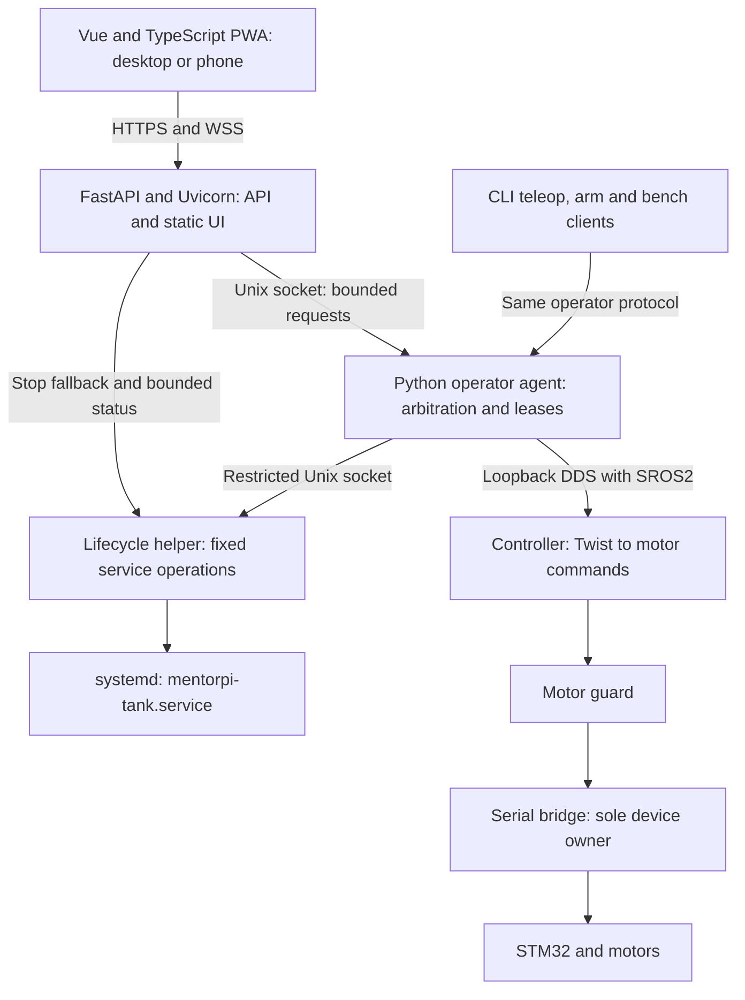

# MentorPi Pi 5 Web Control Design

Status: Existing implementation and acceptance status are recorded per milestone.
M14.3 and M14.4 are deployed; stopped Pi integration passed on 2026-09-29.
M14.5 runtime/API and M14.6 browser controls are deployed. M15 is complete within
the owner-approved Windows Chrome/Wi-Fi scope, with exclusions and physical
timing waivers retained below. M16 release handoff remains pending.

Date: 2026-09-29

Target: Ubuntu 26.04 ARM64 / ROS 2 Lyrical on the MentorPi Tank Pi 5.
Current delivery uses paired runtime/web containers; the
[container design](MENTORPI_CONTAINER_REFACTOR_DESIGN.md) supersedes native
systemd and installation details below. The control contract still applies.

## 1. Purpose and relationship to the native controller

Provide a page served by the Pi that the owner can open from a laptop, desktop,
or phone on the local network to start and stop the controller, arm and disarm,
drive forward/reverse, spin left/right, and inspect status and recent logs.
Driving supports both on-screen buttons and W/S/A/D; Space stops motion.

Selected stack: Vue 3 + TypeScript + Vite PWA frontend, Python FastAPI served
by Uvicorn, and a separate Python operator agent connected over a Unix socket.
The PWA provides the future phone controller using the same API and control
rules as the desktop page. Python permits reuse of configuration, validation,
and supporting libraries without combining web serving with motor supervision.

This extends [the native controller design](MENTORPI_FRESH_CONTROLLER_DESIGN.md).
Reuse its controller, motor guard, serial bridge, kinematics, speed enforcement,
loopback DDS configuration, SROS2 enforcement, and immutable release workflow.
The September 14 repository handoff records native raised-track acceptance;
this document does not independently reverify that evidence. Browser, network,
and new process failure paths require their own acceptance before web driving.

This is a native application under `ubuntu_tank/`, not an extension of the
factory observer in `docker/customization/`. Native/factory mutual exclusion
and sole ownership of `/dev/rrc` by the motion service remain mandatory.
Initial operation is raised-track only. This design does not authorize
on-ground motion, remote unattended driving, or operation beyond visual range.

Version 1 includes everyday controller operations, not a browser shell, package
installation, OS reboot, firmware updates, autonomous navigation, or camera and
LiDAR integration. Deployment and instrumented bench acceptance remain CLI tasks.

## 2. Page and operator interaction

Use a responsive single page with large labeled controls, visible keyboard
hints, and status expressed in text as well as color. Keep Stop motion visible
without scrolling. A conceptual layout is:

```text
MentorPi Tank             Connected | Controller running | Disarmed
Battery: 12.2 V           Control owner: this tab | Raised-track mode

[Take control] [Release control]

                          [Forward W]
                [Left A] [Start / Stop] [Right D]
                          [Reverse S]

Start enables driving. Hold a direction to move.
Release direction to stop moving. Stop / Space also disarms.
Command: zero | Delivery: idle | Last update: 0.1 s ago
[Recent logs] [Diagnostics]
```

Values above are illustrative, not live readings.

| Control | Required behavior |
| --- | --- |
| Take control | Start the controller if stopped, wait for readiness and fresh disarmed state, then acquire and bind the single operator slot. If already running, acquire without restarting it. Report busy ownership without takeover. Never arm or move automatically. |
| Start | Arm if not already armed, requiring ownership, healthy preflight, released inputs and a ready command path. Await confirmed armed state. Never command movement; require a new direction press. |
| Forward / W | Hold for positive linear velocity, zero angular velocity. |
| Reverse / S | Hold for negative linear velocity, zero angular velocity. |
| Left / A | Hold for positive angular velocity (spin left), zero linear velocity. |
| Right / D | Hold for negative angular velocity (spin right), zero linear velocity. |
| Direction release | Immediately request zero. Remain armed while controller health, ownership, and the idle limit permit. |
| Input lease expiry | Stop motion and show “Input paused — release controls.” Keep a healthy controller armed; require fresh neutral acknowledgment and a new press before moving. |
| Stop / Space | Request zero and disarm; clear held input. Retain ownership and keep the controller running. Require explicit Start before driving again. No confirmation dialog. |
| Release control | Cancel this session's pending acquisition or stop/disarm its active control, stop the controller, and relinquish ownership. Report completion only when the controller is confirmed inactive. Keep the dashboard and containers running. |

The page has Take control, Release control, and one Start / Stop button; remove
separate Arm, Disarm and Stop controller buttons. The button shows Start only
when the owning session is confirmed disarmed, and Stop while armed, arming or
paused. Disable Start without ownership/readiness or while release is pending.
For observers or unknown state, offer Stop only; never infer permission to Start.
Space always means Stop, including when the button displays Start. Keyboard
activation of a focused Start button must not turn the Space shortcut into Start.
Repeated Start requests are idempotent; the API uses explicit actions, not a toggle.
A double-click or late response must never rearm after Stop.

Take control checks controller state, starts only if needed, waits for readiness,
and acquires ownership without arming. Show progress and prevent duplicate setup.
Release control remains available during that session's setup and cancels it;
late startup must be stopped before release completes. Stop remains available
during setup to cancel acquisition and prohibit arming, but does not promise
controller shutdown. Failures leave driving disabled and show the reason.
Never stop another owner's controller as acquisition-failure cleanup.

Release control is scoped to the requesting session. Keep ownership unavailable
until shutdown is confirmed so delayed cleanup cannot stop a new owner's controller.
A non-owner cannot use Release to shut down another owner; it can still use Stop.
If shutdown fails or times out, report failure/unconfirmed state, retain the
handoff block and allow bounded retry; never report a completed release prematurely.
Disconnect still invokes immediate zero/disarm and ownership cleanup; it must not
silently rearm or replay Start. Explicit Release additionally requires shutdown.

After five minutes without an owner action, automatically perform Release
control, including controller shutdown. The timeout is configurable and runs on
the Pi, even if the browser stops polling. Show “Control released due to inactivity”
and require Take control again; never reacquire automatically.

While the page is visible, poll `GET /api/v1/status` every second, with at most one
poll outstanding and a bounded request timeout. Poll immediately on load, focus,
resume and completion of ownership operations. WebSocket updates can provide
faster feedback but do not replace polling. Compare the server's ownership
session identifier with this tab's bound session, not just a display owner name.
Discard out-of-order responses using a monotonic server status revision; release
or a newer acquisition must not be undone by an older poll response.
On ownership loss, clear held input and session credentials, disable Start and
driving, and show Take control. On release-in-progress, show shutdown progress
until confirmed inactive; do not offer acquisition as ready before completion.
After three seconds without fresh status, show ownership as unknown and disable
Start/driving while preserving Stop. Existing connection/focus safety rules
still apply sooner. Resume never restores control from cached browser state.

Start has no tracks-raised checkbox or affirmation field. Retain the raised-track
operating restriction and explicit acknowledgment in hardware acceptance tooling.
In the safety contract below, explicit Arm means the internal operation requested
by Start; Disarm means the internal operation requested by Stop. These are states
and safety operations, not additional browser controls or public API endpoints.

On-screen movement uses press-and-hold: a quick click produces only a brief
request between press and release, possibly no visible movement. It never
latches motion after a click. Do not add a minimum movement duration to make a
quick click visible. Default web speeds are 0.20 m/s linear and 0.50 rad/s angular;
version 1 has no speed slider. Server configuration may reduce them, never
exceed the installed controller limits or accepted motor RPS caps.

Keyboard driving activates only after taking control and explicitly focusing
the drive panel. Use `KeyboardEvent.code` (`KeyW`, `KeyS`, `KeyA`, `KeyD`) and
keydown/keyup state; OS key-repeat is not required for continuous holding.
Ignore direction shortcuts in text inputs, editable content, dialogs, or with
Ctrl/Alt/Meta modifiers. Space has stop priority whenever this page has focus,
including its text fields; it cannot be a global shortcut in another window.
Prevent browser scrolling only for handled controls. No key held before Arm may
start motion: require release and a new press.

Exactly one direction/input source is valid at once. Multiple direction keys,
multiple touches, or mixed pointer/keyboard driving request zero and require
all inputs to be released before another direction can start. No diagonal or
combined commands in version 1. Direction reversal passes through zero.

Use pointer capture, and handle `pointerup`, `pointercancel`, and
`lostpointercapture`; cancel when the pointer leaves the drive button bounds.
Suppress compatibility click events that could duplicate a press. Use semantic
buttons and accessible focus styling; keyboard-only users drive with W/S/A/D.
[MDN documents the pointer event and capture lifecycle](https://developer.mozilla.org/en-US/docs/Web/API/Pointer_events).

Window blur, hidden document, navigation, screen lock, or socket loss clears
input and requests stop/disarm. Blur and hidden-page transitions retain the bound
owner while the control connection remains open. Background time counts toward
the configured ownership inactivity timeout (default five minutes), which releases
ownership and stops the controller. Return requires fresh status and explicit Start;
it never resumes movement. Actual transport loss still revokes ownership.
Lifecycle notifications are best effort; the Pi enforces expiry independently.
Hidden-page timers may be throttled, so they cannot supply safety timing.
[Page Visibility API behavior](https://developer.mozilla.org/en-US/docs/Web/API/Page_Visibility_API).

## 3. Process architecture and ownership



### 3.1 Web service

New `mentorpi-tank-web.service`, non-root user `ubuntu-tank-web`, serves bundled
compiled Vue assets and an HTTPS JSON/WebSocket API. Use Python FastAPI with
Pydantic request/response models and one Uvicorn worker managed by systemd.
Disable development reload in production. Uvicorn terminates HTTPS using the
configured certificate; a separate proxy is not required for this deployment.
Lock and verify the native dependency closure before implementation is accepted.
[FastAPI features](https://fastapi.tiangolo.com/features/) and
[server deployment](https://fastapi.tiangolo.com/deployment/manually/).

Use strict validation for safety fields, including booleans, bounded numbers,
enums, and rejection of unexpected fields. Publish versioned OpenAPI for HTTP
routes and generate the frontend HTTP client/types from it. WebSocket messages
need explicit runtime validation and separate versioned JSON schemas and
TypeScript types; they are not automatically described by HTTP OpenAPI.
Serve API documentation assets locally, or disable the
interactive docs in production; no runtime CDN dependency.

The web process has no ROS credentials, serial access, general sudo permission,
or writable release files. It forwards explicit input; it must never regenerate
motion renewals from its last received direction. A stalled web event loop must
cause the independent operator agent to expire motion.

### 3.2 Operator agent

New `mentorpi-tank-operator.service`, a separate Python process under a non-root
dedicated user, owns the sole
authorized operator publisher to `/controller/cmd_vel` and guard arm client.
It uses the existing packaged loopback discovery profile and enforced security.
It has no serial access and retains localhost-only network confinement.
The controller/guard/bridge path and its independent watchdogs remain intact.

Share side-effect-free Python schemas and configuration utilities where useful.
The web process must not import modules that initialize ROS, open hardware, or
start publishers. All control requests cross the authenticated Unix socket;
using the same language does not remove this process boundary.

Use a bounded, versioned Unix-socket protocol with peer credential checks for
the web service and authorized local operator accounts. The agent owns all
monotonic deadlines, command mapping, fresh preflight, control arbitration,
periodic ROS publishing, and state reporting. Socket handlers and ROS service
calls must not block its deadline checks. No nonzero publisher may continue
running in another thread from a cached command without checking its deadline.

Migrate CLI teleop, arm/disarm, and bench command submission to this same agent;
read-only clients may retain their status enclave. This is required integration
work, not an assumption that the existing CLI already serializes publishers.
Provision operator keys for the agent only and retire legacy direct-publisher
credentials when web control is enabled. SROS2 policy and actual key filesystem
access must agree. Preserve bench correlation and terminating-zero observations.
Root/owner intervention remains trusted, as in the native controller design.

One connection holds control, including across browsers, tabs, CLI teleop, and
bench. No silent takeover. Handoff requires stop/disarm confirmation or service
stop before granting another owner. Any connected client may request
Stop even if another tab owns driving. Stop invalidates the old motion
generation before replying so subsequent queued commands cannot restart it.

### 3.3 Lifecycle helper

A small root-owned helper exposes only fixed `start`, `stop`, `status`, and
bounded recent-log operations for `mentorpi-tank.service` over a protected Unix
socket. Use fixed argument arrays and sanitized environment, never shell text,
caller-selected unit names, file paths, or arbitrary arguments. Check peer
credentials and request sizes. The web peer may request stop/status/logs directly
when the operator agent is unavailable; start requires agent coordination.

Extract and reuse installed native preflight/lifecycle logic instead of invoking
a mutable checkout's `deploy.sh` or blindly calling `systemctl start` without
preflight. Serialize starts and release changes under the deployment lock.
Activation must revoke control and stop the graph before switching releases;
reject starts while activation/recovery is pending. Stop must not wait behind
a long build/deployment lock or an unavailable ROS response. Define lock ordering
and bounded cancellation explicitly in implementation tests.

The web and operator services remain available with the motion service stopped;
they must not have a dependency that starts the motor service just to display
the page. Starting any new service leaves ownership empty and motion disabled.
Lifecycle operation completion means observed systemd state, not subprocess
launch success. Report stop failure as unconfirmed, never as physical rest.

Administrative boot and maintenance may group `mentorpi-tank.service` and
`mentorpi-tank-operator.service` under `mentorpi-tank-stack.target` for a single
start/stop command. This grouping does not merge process identities or replace
independent service control: web lifecycle operations still start and stop only
the motion service, allowing the operator and web status paths to remain up while
the controller is unavailable.

### 3.4 Vue frontend and PWA lifecycle

Use Vue 3 single-file components, TypeScript, Vite, and `vite-plugin-pwa`.
Start with one responsive page and simple component/composable state; add routing
or a state-management library only when screens require it. Separate input
handling, API transport, telemetry, and rendering. Keep one connection/input
controller per active page and clean it up on component unmount.
[Vue introduction](https://vuejs.org/guide/introduction.html) and
[Vite PWA guide](https://vite-pwa-org.netlify.app/guide/).

Build on the workstation/build host, or on the Pi 5 with Node.js and npm installed
as build-time dependencies, and package the static output with the backend.
The Pi serves those files without a Node.js server or frontend build tools at
runtime. A web app manifest defines the name, icons, start URL, scope,
and standalone display. Use the same stable HTTPS origin for installation,
API calls and WSS; document certificate trust on phones.

The service worker caches only versioned interface assets. Exclude `/api/`,
telemetry and control requests from caching and background
sync; never persist or replay commands. The interface can open while the Pi is
unreachable, but must show disconnected status with driving disabled and no
cached battery/armed state presented as live. Internet access is unnecessary
when the phone can reach the Pi over the local network.

Use an explicit update prompt, not automatic page reload or forced service-worker
activation during control. Stop/disarm and relinquish ownership before accepting
an update. Every freshly loaded or resumed client checks backend protocol and
release compatibility before acquiring control; an incompatible cached client
remains unable to arm. Backend checks must reject incompatible clients too.
Rollback must work even when a phone retains newer cached assets: incompatible
clients can reload the installed UI, but cannot regain control through stale
sessions. Network-only recovery/version endpoints remain reachable outside the
cached app shell.

The service worker is not a motion publisher or a timer for renewing leases.
Phone lock, app switching, suspension, and loss of focus follow the existing
stop/expiry rules. Resume requires fresh state and explicit control acquisition
and arm. Validate installation and lifecycle behavior on actual Android/iOS
devices; desktop emulation alone does not establish mobile acceptance.
[Service worker lifecycle and HTTPS requirements](https://developer.mozilla.org/en-US/docs/Web/API/Service_Worker_API).

## 4. Motion lease and state contract

This revised contract separates permission to remain armed from permission to
publish nonzero motion. M14.3 and M14.4 are deployed with stopped integration verified; M15 physical
validation remains pending. M14.5/M14.6 change the public controls while retaining
these input-expiry and hard-fault rules.
The [bug report](BUG_WEB_CONTROL_LEASE_EXPIRY.md) records the deployed evidence.

### 4.1 States and deadlines

Application states are `NO_OWNER`, `OWNED_DISARMED`, `ARMING`, `ARMED_IDLE`,
`DRIVING`, `INPUT_PAUSED`, and `FAULT`. Service state, actual guard state, and
telemetry freshness remain separate fields. `INPUT_PAUSED` permits only zero
commands; it retains ownership and an already-armed healthy guard. It never
arms a disarmed guard automatically.

1. Acquire ownership while disarmed. Resolve one installed release and prepare
   ROS discovery/subscriptions before enabling Arm.
2. Arm only with fresh guard/bridge health, valid battery and hardware preflight,
   no conflicting stack or operator, and neutral input. Missing or stale health
   blocks arming. Retain the 250 ms first-command deadline, downstream zero
   confirmation, and compensating disarm for failed or late Arm completion.
3. Publish at 20 Hz from current agent state. Only `ARMED_IDLE`/`DRIVING` accept
   nonzero intent with a valid input lease and completed recovery handshake.
   `INPUT_PAUSED` continuously publishes zero while health remains valid.
4. Use configured `lease_duration_sec` (default 1 second), checked at least
   every 20 ms. Expiry clears
   nonzero intent immediately, submits zero without waiting for the publication
   tick, and enters `INPUT_PAUSED`. Do not request guard disarm solely for this
   timeout, including when already idle. Repeated expiry while paused is
   idempotent and cannot postpone other deadlines.
5. Keep the 30-second idle limit and 5-second continuous-hold cap. Pause starts
   idle time when driving ends; a timeout while already idle does not reset it.
   Neutral recovery, repeated expired responses, and status polling cannot
   extend idle time. Idle expiry and the hold cap still stop and disarm.
   Recovery cannot reset a still-held input's hold budget or turn it into a
   new press.

The existing guard/bridge watchdogs remain independent. Keeping the guard armed
is conditional on fresh healthy telemetry, a functioning zero-publication path,
and a live owner connection. If the agent cannot establish those conditions,
use the existing fault/disarm path. Agent crash or hang must still trigger the
independent downstream watchdogs; this change must not renew their deadlines
from a stale cached command.

### 4.1.1 Ownership inactivity timeout

Add `control_idle_timeout_sec` to installed `web.yaml`, default `300.0` seconds.
Load and enforce it in the runtime operator, alongside `lease_duration_sec`.
Accept only finite positive numbers; reject booleans, zero, negative and non-finite
values at configuration load. Retain valid installed overrides. Changes require
restart while stopped/disarmed; the browser cannot change or disable the timeout.
Report the effective value in status. This is separate from the 30-second armed
idle disarm limit, input lease, binding timeout and continuous-hold limit; none
of those deadlines are extended or replaced.

Start the Pi monotonic inactivity deadline when ownership is granted. Reset it
only for a fresh accepted action from that owning session: explicit Start or Stop,
or a direction press/change/release. A held direction's periodic intent does not
count as a new action. Observe direction transitions in the validated runtime
input stream; a return from motion to neutral counts once. Start/Stop carry fresh
request IDs and are counted once after acceptance. No separate heartbeat or
activity endpoint renews ownership.

Polling, status/log reads, WebSocket pings, challenge exchanges, automatic neutral
messages/recovery, duplicate requests, rejected/stale input, key-repeat, mouse
movement and other clients' actions never reset this deadline. A safety-generated
zero on pause/disconnect is not owner activity. CLI and bench owners use the same
runtime policy; their background traffic cannot keep abandoned ownership alive.

At `now >= deadline`, invalidate motion and pending Start immediately, then run
the same zero/disarm, controller shutdown and ownership-release operation as
explicit Release. Enforce expiry in the runtime deadline loop, independently of
web requests and without blocking motion watchdogs. Expiry wins over input
arriving at or after the deadline. Late requests cannot renew the expired session,
rearm it or affect a subsequent owner. If shutdown fails, remain disarmed with
handoff blocked and report failure; use the same bounded retry/recovery rules as
explicit Release. Never silently restore ownership after a shutdown failure.

Status reports the ownership session ID, monotonic status revision, effective
`control_idle_timeout_sec`, remaining inactivity seconds, release progress and
last release reason (`CONTROL_IDLE_TIMEOUT` for this case). Retain the reason
and released session ID long enough for a disconnected/slow client to identify
its expiry even if another client subsequently takes control; do not expose
private bind tokens. Remaining time is informational; only the Pi decides expiry.

### 4.2 Fresh input after a pause

Keep the control epoch for ownership and Arm changes. Add an agent-owned input
generation for motion recovery; it is not a new owner or an Arm request.

- On entry to `INPUT_PAUSED`, advance the input generation and invalidate all
  outstanding challenges and queued intent. Preserve the control epoch and
  connection binding. Continue issuing recovery challenges while paused.
- Every challenge, response, and acknowledgment carries both identifiers.
  Challenges remain single-use, issued every 50 ms, and expire after the configured
  `lease_duration_sec` from issuance on the Pi monotonic clock. Accepted responses cannot extend the
  lease beyond the challenge's original deadline. Reject stale generations,
  expired/reused tokens, wrong owners, and out-of-order sequences.
- The browser clears its commanded direction when it learns of a pause, but
  retains which keys/pointers still require release. A synthesized zero is
  insufficient proof of release. Ignore key-repeat and inputs held across the
  pause; wait until all participating controls have been released.
- Send neutral in response to a fresh challenge in the new generation only
  after release. The agent accepts no nonzero response while paused. Once it
  confirms downstream zero delivery and healthy guard state, it acknowledges
  neutral recovery and enters `ARMED_IDLE` with a valid input lease.
- Enable direction input only after that acknowledgment. Require a new press
  occurring after acknowledgment; discard presses made while recovery was
  pending. If the lease expires again, repeat the pause handshake. Neither
  buffered motion nor a still-held direction can resume movement.

The web service only relays input and recovery state; it must never synthesize
renewals from the last direction. Bound queues and keep latest intent only.
Stop has priority over recovery and invalidates both identifiers before replying.
Concurrent Stop, health failure, or ownership change cancels recovery. Late
recovery acknowledgments cannot enable input in a disarmed or newer session.
Browser wall clocks are not authoritative for any deadline.

### 4.3 Events that still disarm

| Event | Required result |
| --- | --- |
| Ownership inactivity timeout | Zero/disarm, cancel pending Start, stop the controller and release ownership; require a new Take control. |
| Input expiry with healthy controller and live connection | Zero, `INPUT_PAUSED`, retain Arm and ownership, require neutral acknowledgment and fresh press. |
| Explicit Stop, Space, release control, idle timeout, or hold cap | Zero/disarm and invalidate motion; require explicit Start before moving again. Release control also stops the controller and relinquishes ownership. |
| Browser blur, hidden page, navigation, screen lock, or detected socket loss | Clear input and request stop/disarm. Server-observed owner disconnect disarms; reconnect never resumes motion or automatically arms. |
| Silent browser/network/web stall with socket still open | Input expiry stops motion first; remain paused only while controller health permits, then disarm at the idle limit if communication does not recover. |
| Stale/failed guard, bridge, battery, serial, or zero-delivery health | Fault/zero/disarm; require healthy preflight and explicit Arm to recover. |
| Controller/operator restart, deployment admission loss, or release change | Invalidate authority and pending recovery; restart stopped, disarmed, and ownerless as applicable. |

Lifecycle notifications are best effort. An unreported browser suspension or
network outage therefore follows input expiry until disconnect or idle expiry is
observed. A recovered transport alone is never permission to move.

### 4.4 Timing and usability acceptance

Healthy-agent zero submission remains targeted within 20 ms of input expiry or
receipt of Stop. The owner-selected default input lease is 1 second, replacing 150 ms.
The budget below uses that default; acceptance records the effective configuration.
The resulting expiry-to-zero software budget is at most 1.02 seconds from the
last accepted challenge's issuance, not from the delayed response's arrival.
Direction release and explicit Stop still request zero immediately on receipt;
they do not wait for this timeout. Keep the 50 ms challenge/publication cadence,
250 ms first-command deadline, downstream watchdogs, and idle/hold limits unchanged.

For input-loss cases, use a proposed physical-rest acceptance target of
1.2 seconds from the injected fault: 1 second of input lease, up to 20 ms for
deadline handling, and 180 ms for downstream delivery and deceleration. This
supersedes the incompatible 300 ms input-loss target and is not a measured
stopping guarantee. At 0.20 m/s, the lease alone permits roughly 0.20 m of travel
before zero is requested, plus scheduling, delivery and braking distance; at
0.50 rad/s it permits roughly 0.50 rad of rotation before those additional delays.
M15 must measure actual stopping time and distance with tracks raised before
acceptance. Agent/downstream failure bounds remain unchanged. Space does not
replace the physical disconnect.

Observed stalls of about 409 ms exceeded the deployed 150 ms lease but are below
the new 1-second deadline. Test those stalls as recoverable transport delays and
inject gaps longer than 1 second to validate `INPUT_PAUSED`. The longer lease
also allows older input to remain valid longer; it does not prove the network
problem resolved. M15 measures both usability and physical stopping. Ethernet
comparison alone cannot certify Wi-Fi; failed limits remain open gates.

## 5. Network access and API

This is a personal, single-owner tank on a trusted local network. The web UI
and API require no user authentication: no login/logout, passwords, accounts,
API keys, bearer tokens, authentication cookies, or login-session store.
Any client that can reach the configured interface can view status and request
control. Take control selects one active connection; it does not identify a user.

Default deployment is HTTPS on a configured LAN address, port 8443; advertise
the actual configured URL in CLI status. Provision an owner-trusted server
certificate for browser/PWA support; no client certificate is required. Serve
all assets locally for operation without Internet access.

Validate the exact Host/Origin on HTTP and WebSocket browser requests; reject
cross-origin mutations and missing-Origin browser controls. Use a restrictive
same-origin CSP, deny framing, and render logs as text. Bound connections,
input sizes, and log responses; control expiry runs independently of request
load. These browser safeguards do not authenticate users. Control ownership,
challenge tokens, epochs, explicit arming, and stop deadlines remain motion
safety mechanisms. Connection loss invalidates authority; input expiry invalidates
only the input generation while the conditions in §4 permit retaining Arm.
Existing native SROS2 and local process-identity checks remain internal controller
safeguards; they add no web login or user-authentication workflow.

The implemented HTTP, WebSocket and controller Unix socket interfaces are listed
in the [controller and web interface reference](../ubuntu_tank/docs/CONTROL_INTERFACES.md).
It documents request/result fields, ownership, operation polling and failures.
This design retains the behavioral requirements and milestone acceptance criteria.

The M14.5 public API mirrors the page: Take control, Release control, Start and
Stop. Remove `controller/stop` and `control/arm`, and any public disarm alias;
`controller/start` remains absent. Old routes must reject requests without side
effects, not redirect to new actions. Keep arm/disarm and controller lifecycle
operations internal to the runtime and trusted local maintenance tooling.
The browser must not chain stop/release or start/acquire calls. Version HTTP/WS/IPC
schemas and generated clients together; reject incompatible clients before any
mutation, including when an old client's release semantics differ.

The runtime coordinates acquisition and lifecycle state under the existing
ownership/admission rules. Only one acquisition may be pending; competing owners
receive busy without disturbing the active controller. Repeated request IDs
refer to the same operation, not another startup or ownership grant. A failed or
timed-out start cannot grant ownership. Successful operation results expose only
the requesting session's bind credentials, never public status/logs. Bound the
bind window and revoke unbound ownership when it expires; setup never arms.

Stop cancels pending setup and Start before reporting success; Release cancels
only its own setup/ownership and also shuts down the controller. Runtime operation
generations fence every late startup, acquire and arm completion. A Start request
sent before Stop must not arm afterward, including duplicate retries. During
Release, late startup is stopped again and no new owner is granted until shutdown
is confirmed. Stop remains independent of ownership, responsive during startup,
arming and shutdown, and available when deployment admission is closed.

All mutation requests are bounded JSON with schema version and request ID.
Directions are enums, not arbitrary velocities, ROS topics, or service names.
Reject unexpected fields, invalid booleans/numbers, and oversized frames before
changing state. Use stable errors such as `NOT_OWNER`, `LEASE_EXPIRED`,
`PREFLIGHT_FAILED`, `CONTROLLER_UNAVAILABLE`, and `DEPLOYMENT_BUSY`.
Input expiry is a recoverable pause, reported with `INPUT_PAUSED`, its reason,
input generation, and recovery readiness. It must not be routed through the
browser's generic fault handler that sends Stop/disarm. Publish the revised
HTTP/WS/IPC schemas and protocol compatibility together; older clients must be
rejected before control acquisition rather than guessing recovery semantics.
Retries of the same operation ID must not repeat an arm or revive motion.
Never automatically retry nonzero intent or arm after reconnection.

Display service running, guard armed, requested velocity, and observed delivery
as distinct facts. Timestamp telemetry on the Pi and expose its age; historical
transient-local ROS state alone cannot establish current health. Stale telemetry
disables arming/driving and triggers disarm. Define per-topic freshness thresholds
from actual publisher rates during M10. Do not label a successful serial write
as physical movement or show a stopped icon solely because zero was requested.

## 6. Files, installation, and rollback

Proposed source layout:

```text
ubuntu_tank/
  web/src/                        Vue components, TypeScript, generated API types
  web/public/                     PWA icons and other public static assets
  web/package.json                frontend build/test dependencies
  web/package-lock.json           locked frontend dependency graph
  web/vite.config.ts              Vite and PWA cache/update configuration
  web/dist/                       generated static output; ignored, packaged
  src/ubuntu_tank_web/             FastAPI API, static serving and socket client
  src/ubuntu_tank_operator/        ROS agent, leases, arbitration, schemas
  host/mentorpi-tank-web.service
  host/mentorpi-tank-operator.service
  host/mentorpi-tank-lifecycle.*    restricted helper/socket assets
  config/web/                     documented non-secret defaults
  tests/                          protocol, browser, deployment and fault tests
```

Install code with the same immutable release under `/opt/ubuntu_tank`;
configuration and TLS material below `/etc/opt/ubuntu_tank/web`, ephemeral sockets
and sessions below `/run/ubuntu_tank-web`, and bounded persistent diagnostics
below `/var/opt/ubuntu_tank/web`. Split file ownership so only the web service
reads its TLS material and only the agent reads operator ROS keys.
Neither new non-root account joins the serial-access group.

Document `listen_address`, `port`, certificate/key paths, allowed origin,
web speed caps, lease/publication periods,
idle timeout, and maximum hold duration. Reject inconsistent configurations at
startup; browser requests cannot override timing or speed limits. Bind safely
to loopback until LAN address and TLS are configured.

Extend existing package/install/activate/rollback transactions to include new
units, schemas, credentials permissions, and SROS2 migration. Activation stops
all command producers and invalidates sessions; mixed release/protocol versions
fail closed. Never hot-reload a driving process. Rollback to a native-only release
disables the web/agent units and restores matching native CLI/security assets,
leaving the controller stopped and disarmed. Preserve credentials separately
from shipped artifacts and omit secrets from reports.

Workstation Python tooling stays in the repository `.venv`. Target/build-root
Python, FastAPI, Uvicorn, Pydantic, and their transitive dependencies must be
apt/ROS-managed and added to the locked closure. Verify compatible ARM64 packages
in M10; unresolved packaging is a gate, not permission for target pip installs
or nested virtual environments. Lock build-host Node.js/npm and frontend package
versions; use `npm ci`, TypeScript checking, tests, and a production Vite build.
Record frontend and backend identity in the release manifest and include only
required static output in the installed frontend payload, not `node_modules`.
Browser-test tooling is development-only and version-locked. All new commands
and deployment flags are proposed until implemented and documented in README.

## 7. Trackable implementation milestones

Continue numbering after native Milestone 9. Unchecked boxes identify pending
work. Complete M11.1 before continuing with M12; M12 and M13 can then proceed
independently, with M14 integrating both. Existing completed checkboxes describe
the contract implemented at that time, including the superseded Arm and controller
Stop interfaces in M14.3/M14.4. The remaining work proceeds in order:
M14.5 simplified runtime/API → M14.6 browser controls → M15 deployment and
physical acceptance → M16 release handoff. M15 supplies the revised web-control evidence
for container C5; M16 and container C6 release sign-off require that acceptance.
Earlier reports do not certify the revised release.

### Milestone 10 — Protocol, state machine, and dependency closure

- [x] Define versioned schemas, state transitions, monotonic challenge deadlines,
  error codes, telemetry freshness, configuration validation, and lock ordering.
- [x] Lock native web dependencies and document exact release/API compatibility.
- [x] Verify FastAPI/Uvicorn/Pydantic ARM64 apt closure; lock Vue/TypeScript/Vite
  and PWA build dependencies and define HTTP/OpenAPI and WebSocket schemas.
- [x] Add deterministic tests for expiry, late/replayed intent, stop priority,
  arm cancellation, stale state, idle timeout, and the continuous-hold cap.

Exit: hardware-free tests prove no stale input can create or revive motion.
Status: Completed. Hardware-free deterministic test suite passes 100% across all
monotonic challenge lease, 5.0 s continuous hold, 30.0 s idle timeout, stop priority,
arm cancellation, and telemetry freshness gates.

### Milestone 11 — Shared operator agent and CLI integration

- [x] Implement the loopback-only ROS operator agent and credential-checked IPC.
- [x] Route teleop, arm/disarm, and bench through exclusive ownership; migrate
  SROS2 permissions/key access and preserve read-only diagnostics.
- [x] Verify first-command zero, delivery correlation, fault recovery, agent
  crash behavior, and rejection of competing direct publishers.

Exit: native middleware tests show exactly one command authority and working CLI
regressions. Hardware-free evidence remains distinct from target-Pi evidence.
Status: Completed. Verified loopback Fast DDS operator agent with Unix domain
socket IPC and SO_PEERCRED UID/PID verification, newline-delimited JSON framing
capped at 64 KiB, exclusive single-operator arbitration returning DEPLOYMENT_BUSY
to competing callers, fail-closed disconnect handling (disconnect of owner
automatically stops and disarms), stop priority (any connected client can stop
and disarm), 250 ms first-command zero deadline, single-use monotonic challenge-intent
leases, and rolling 5-stage delivery observation buffer. CLI integrations
(operator_client, teleop_key_node, bench_client) routed through agent IPC with
fail-closed defaults; explicit direct ROS mode holds the same provisioned
cross-user authority lock for the publisher lifetime. Arm success requires a
fresh complete downstream zero write within the original deadline, and deadline
validation samples monotonic time after lock acquisition and again before motion
publication. Hardened systemd service mentorpi-tank-operator.service configured.
Comprehensive test suite passes 100% (66/66 tests in test_milestone11_operator_agent.py).

### Milestone 11.1 — Behavior-based test cleanup

Scope: change tests and test-only fixtures or harnesses only. Do not modify
production source, handwritten runtime configuration, packaging, service units,
deployment commands, or installed behavior. If authentic behavioral validation
would require a production change, record that validation as pending instead.

- [x] Inventory Python and shell tests that read handwritten source, systemd,
  udev, tmpfiles, YAML, XML, JSON, TOML, or other static configuration merely to
  assert literal strings, syntax fragments, or repeated parsed values.
- [x] Replace source-code introspection with tests through the affected public
  API, executable, or process boundary, asserting observable behavior and failure
  handling rather than implementation text.
- [x] Exercise handwritten configuration through its real consumer or an official
  parser, including systemd, tmpfiles, ROS launch/security, and application
  configuration surfaces. Assert the resulting behavior, permissions, lifecycle,
  or rejection instead of restating file contents.
- [x] Retain content-level assertions only when code under test generates the
  artifact and its generated content is the behavioral contract. Remove obsolete
  or duplicate assertions without weakening the safety invariant they represented.
- [x] Record target-only validation as pending when the authentic consumer is not
  available hardware-free; do not replace unavailable runtime evidence with a
  source-text assertion. Run the full hardware-free suite and boundary gates after
  the cleanup, with no intended production behavior change.

Exit: no test treats literal text in handwritten source or configuration as a
substitute for behavior. Every retained safety claim is exercised through a real
consumer or explicitly recorded as pending, and all hardware-free gates pass.

### Milestone 12 — Web API and service lifecycle

- [x] Remove M10 login/logout schemas and exports, authentication error codes,
  credential-file/login-session configuration, and matching OpenAPI generator,
  generated specification, and TypeScript types. Retain connection identifiers,
  motion challenges, and leases for control arbitration; they are not login sessions.
- [x] Implement TLS provisioning, same-origin controls, bounded HTTP/WSS,
  agent challenge relay, status, logs, and operation results.
- [x] Implement FastAPI strict models, OpenAPI export, WebSocket validation,
  compatibility/version endpoint, and the single-worker Uvicorn systemd service.
- [x] Implement the narrow lifecycle helper and start/stop deployment interlocks.
- [x] Test cross-origin requests, oversized messages, request
  floods, frozen web process, and Stop when the agent or ROS is unavailable.

Exit: the page manages a mocked service without login or root web privileges;
only the active control owner can arm/drive, any client can stop, and queue
congestion cannot prolong an agent lease.

### Milestone 13 — Vue browser and PWA driving interface

- [x] Implement the page, hold buttons, W/S/A/D, Space, acknowledgments, status,
  ownership display, responsive layout, and accessible focus behavior.
- [x] Automate browser tests for key release, focus loss, hidden tabs, pointer
  cancellation, mixed inputs, held keys across Arm, delayed messages, multiple
  tabs, connection loss, and reconnection with no automatic resume.
- [x] Verify fresh neutral intent while idle and immediate local input clearing.
- [x] Build Vue/TypeScript components and the generated HTTP API client; add
  manifest/icons, asset-only caching, explicit updates, and offline status.
- [x] Test that offline requests cannot queue/replay movement, updates require
  disarm, and stale or incompatible cached clients cannot arm.

Exit: real browser tests against a mocked agent satisfy every interaction in §2.

### Milestone 14 — Installed Pi integration and rollback

- [x] Package all services/assets; verify ARM64 imports, dependency closure,
  ownership, TLS trust setup, and production systemd confinement on the Pi.
- [x] Verify installed native DDS delivery without motor power, CLI/browser
  exclusion, web availability while the controller is stopped, and safe restart.
- [x] Test activation, interrupted activation, incompatible protocols, and
  rollback to native-only releases without retained sessions or motion.
- [x] Verify packaged static frontend delivery without Node.js at runtime,
  phone-trusted HTTPS, PWA installation, and cached-client recovery on rollback.

Exit: reproducible target-Pi installation and recovery pass; motion gates remain
blocked until raised-track testing is explicitly undertaken.

### Milestone 14.1 — Real Pi 5 installation and deployment integration tests

Implement and run a dedicated integration suite on a real ARM64 Pi 5 running
the supported native Ubuntu image. **Always build and install before running
integration tests.** The owner or deployment pipeline runs the complete production
build, packaging, installation, and activation workflow first; the integration
test then verifies the resulting installed system. It must not perform an implicit
initial build or installation to satisfy missing prerequisites. Organize tests
around complete workflows and their final state, not individual scripts. Expose
verification through a separate, explicit target-test command, outside the default
development-machine test run. Lifecycle/recovery scenarios can change installed
files and services, but their verification likewise follows the corresponding
completed deployment or recovery operation. Keep motor power off
and motion disarmed throughout; movement testing remains Milestone 15.

Required sequence:

1. Prepare the host and dependencies using the production setup commands, including
   any required reboot.
2. Build the frontend from the checked-out source:

   ```bash
   cd ubuntu_tank/web
   npm ci
   npm run build
   ```

   This generates `ubuntu_tank/web/dist/`; keep it ignored by Git. Run the build
   on the Pi 5 or transfer the generated output from the build computer to the
   packaging workspace. Node.js/npm are build-time requirements only.
3. Build the native ROS workspace and package the complete release, including
   the generated frontend assets. Install and activate that release on the Pi 5
   using the production deployment commands. Stop if any step fails.
4. Run integration verification against that installed, active release. Check
   release identity, manifests, and installed frontend assets before service
   tests. Missing or stale build/install prerequisites must produce an actionable
   failure, not trigger a build, installation, or a misleading pass. Merely building
   `web/dist/` in the checkout does not update an already installed release.

After installation, run from the repository root:

```bash
sudo ./ubuntu_tank/deploy.sh target-test --expected-release-id YOUR_INSTALLED_RELEASE_ID
```

The command never builds or performs an initial installation. Normal runs verify
the installed system and service lifecycle, leaving motion stopped/disarmed.
`--expected-release-id` rejects an unintended or stale active release; omit it
only when intentionally verifying whichever release is currently active.

Repeat-install, upgrade, recovery and offline rollback scenarios are opt-in:
add `--deployment-scenarios --release-archive /absolute/path/current.tar.zst
--upgrade-release-archive /absolute/path/upgrade.tar.zst
--native-release-archive /absolute/path/native-release.tar.zst` to that command.
All archives must be built beforehand. The repeat-install archive must match the
active release; the upgrade archive must be web-enabled with a different release
ID. The native archive must be a genuinely production-built ARM64 release (including
the ROS workspace and SROS2 policy tooling, without web/lifecycle units). Build
that archive from the native-only milestone using its production packaging
workflow; do not construct a synthetic install tree. The suite installs and
activates that baseline, activates the web release, then uses production rollback
to verify the native result. The archive must use the target's release prefix.
For these optional scenarios, the operator login defaults to `SUDO_USER`; direct
root invocation requires `--operator-user LOGIN`. Archive paths and the login
are checked before host mutation, except
that archive integrity and production build provenance are validated by the
production installer. `--inspect-only` does not require the archive or login.
Cleanup confirms services are stopped before restoring baseline files and treats
shutdown or systemd reload failure as a failed run. Real target execution remains
required; passing development tests does not verify Pi installation.

- [x] Separate production build/installation from integration verification using the documented
  production entrypoints: host preflight and preparation, dependency setup,
  build, packaging, installation, and activation, including required reboots.
  Require successful completion before starting integration verification; remove
  automatic initial setup/build/install from the integration-test entrypoint.
  Let the production entrypoints invoke their helpers normally; do not create a separate
  test for each script or installation step. Preserve production safety checks
  and stop the workflow if a required step fails.
- [x] Implement target checks and a reproducible setup procedure for a clean
  Pi image with a recoverable baseline. Use real apt/dpkg, ROS, systemd, udev,
  users/groups, and production paths; do not replace them with mocked commands,
  synthetic install trees, or a development-machine imitation of the Pi.
- [x] After the whole installation/deployment workflow completes, run a
  comprehensive verification phase covering every installed configuration artifact:
  package sources and locked versions, users/groups, device rules, runtime
  directories, service units and enablement, environment files, controller and
  web settings, DDS/SROS2 configuration and credentials, TLS files, release
  manifests, frontend assets, and the active-release link.
- [x] Check installed file locations, ownership, permissions, preserved user
  settings, and generated values against the installation inputs and deployment
  contract. Load configuration through its actual consumer and verify effective
  service settings, ARM64 imports, protected IPC, native DDS communication,
  HTTPS/static delivery, and status/log access while the controller is stopped.
  Reading checked-in configuration text alone is not installation verification.
- [x] Exercise fresh installation, repeat installation, upgrade, activation,
  controlled interruption and recovery, and offline rollback to web-enabled and
  native-only baselines. Verify configuration preservation, legacy snapshots,
  removal of obsolete installed files, and stopped/disarmed state after recovery.
  Run each as a complete workflow on the recoverable target, followed by checks
  of the resulting system state, with documented reset steps. For an interrupted
  workflow, verify the recovered state after recovery completes.
- [x] Record the exact release and starting image, invoked commands, exit codes,
  installed-state checks, logs, and recovery outcome. Missing target services or
  unexecuted cases remain pending; a mock or development-machine pass cannot
  complete this milestone.

Exit: the complete installation/deployment workflow and recovery scenarios have
reproducible real-Pi execution evidence, and comprehensive post-run verification
confirms that all required files and configuration are in place and work through their
real consumers. The Pi can be restored to the recorded baseline without enabling
motion. These results supply the target evidence required by Milestone 14.

#### Installed configuration and generated-file verification checklist

Verify this checklist after the complete workflow, not through separate tests of
each producing script. Paths below use the default production layout;
`<release>` is `/opt/ubuntu_tank/releases/<release-id>` and `<keystore>` is
`/etc/opt/ubuntu_tank/security/keystore`. Resolve configured overrides and symlink
targets from the actual installation. Copied configuration is included because
its installed destination must be verified even when its contents were not
generated. Do not log private keys or credential contents.

| Installed configuration / output | Producer | Required post-run verification |
| --- | --- | --- |
| `/etc/opt/ubuntu_tank/controller.yaml` | `deployment_manager.py` installation; copied from release defaults only when missing | Real controller configuration loader accepts it; calibration and safety limits match installation inputs, and existing owner settings survive reinstall/upgrade. |
| `/etc/opt/ubuntu_tank/mentorpi-tank.env` | `deployment_manager.py` installation and `migrate_host_env()` during activation | Systemd and launchers load the intended ROS/DDS/security environment; profile, keystore, log and controller-config paths resolve; unrelated owner settings survive migration. |
| `/etc/opt/ubuntu_tank/web/web.yaml` | `deployment_manager.py` installation; copied only when missing | Web configuration loader accepts listen address/port, origins, TLS paths, IPC paths and motion limits; actual HTTPS access works at the configured address and existing settings are preserved. |
| `/etc/systemd/system/mentorpi-tank.service`, `mentorpi-tank-operator.service`, `mentorpi-tank-web.service`, `mentorpi-tank-lifecycle.service`, `mentorpi-tank-recover.service`, `mentorpi-tank-stack.target` (all in that directory) | `deployment_manager.py` activation copies release units | Systemd loads the installed units without errors, resolves executable/environment paths, and applies the intended users, groups, dependencies and restrictions. Check actual start/stop and recovery behavior with motor power off. Check enablement against the documented setup procedure; a unit's `[Install]` section alone does not enable it. |
| `/etc/udev/rules.d/99-mentorpi-rrc.rules` | `deployment_manager.py` merges candidate rule with the selected device identity | Rule retains the selected serial or USB-port discriminator; real udev binds the intended device as `/dev/rrc` with the required group/access. Verify no ambiguous device selection. |
| `/etc/tmpfiles.d/ubuntu-tank.conf` | `deployment_manager.py` copies release tmpfiles configuration and invokes `systemd-tmpfiles` | Real tmpfiles processing creates the required runtime/state paths with effective owner/group/mode, including after reboot. Verify the resulting filesystem, not just directives. |
| `<release>/config/controller.yaml`, `config/web/web.yaml`, `config/fastdds/loopback.xml` | `deployment_manager.py` packaging copies configuration; installation extracts it | Manifest integrity passes; defaults are available; active Fast DDS profile is accepted and real native DDS traffic stays on the configured loopback transport. Distinguish release defaults from mutable host configuration above. |
| `<release>/config/sros2/governance.xml`, `policies.xml`, `permissions/{controller,guard,bridge,operator,status}_permissions.xml`, `schemas/omg_shared_ca_governance.xsd`, `schemas/omg_shared_ca_permissions.xsd` | Packaging copies SROS2 policy inputs and schemas | Installed policy validation succeeds; generated signed grants correspond to the selected release and real secured participants communicate as intended. |
| `<keystore>/identity_ca.key.pem`, `identity_ca.cert.pem`, `permissions_ca.key.pem`, `permissions_ca.cert.pem`, `governance.xml`, `governance.p7s` | `deployment_manager.py` `_provision_sros2_keystore()` generates/preserves CA identities and signs the policy | Validate certificate/key pairs and signed governance, owner/mode and service access; preserve existing identities across upgrades. Resolve the live keystore link to a complete published generation. |
| `<keystore>/enclaves/ubuntu_tank/<role>/{key.pem,cert.pem,identity_ca.cert.pem,permissions_ca.cert.pem,governance.p7s,permissions.p7s}` for each of `controller`, `guard`, `bridge`, `operator`, `status` | Same SROS2 provisioning function | Every enclave has its full file set; certificates and signatures validate; intended service roles can read their credentials and start with security enforcement. Temporary `request.csr` files are removed after successful generation. |
| `/var/opt/ubuntu_tank/web/certs/server.crt`, `server.key` (or the paths configured in `web.yaml`) | Web entrypoint calls `ubuntu_tank_web/tls.py` on startup; not created by package installation alone | After the explicit web-service startup phase, verify readable certificate, matching protected private key, validity and configured hostname/IP coverage, and browser HTTPS trust. Preserve valid owner-provided credentials. |
| `/etc/ros/rosdep/sources.list.d/10-ubuntu-tank.list` | `install_ros2.sh install-deps` generates it | Rosdep consumes the local verified source files; obsolete unpinned `20-default.list` is absent after this workflow. |
| `/var/opt/ubuntu_tank/rosdep_sources/index-v4.yaml`, `base.yaml`, `python.yaml`, `ruby.yaml` | `install_ros2.sh install-deps` downloads and verifies pinned inputs | Files match the lock's hashes and dependency resolution succeeds. Verify the effective `ROSDISTRO_INDEX_URL` used by the command separately; downloading `index-v4.yaml` does not prove the resolver used that local file. |
| System locale configuration affected by `locale-gen` / `update-locale` (`/etc/locale.gen` where used; `/etc/default/locale` or the target package's actual locale-config destination) | `install_ros2.sh prepare-host` invokes distribution locale tools | Record the files actually modified by the installed tools; a fresh process has the requested UTF-8 locale and the generated locale is available. Do not assume every listed distribution-dependent path exists. |
| Ubuntu APT source files actually changed under `/etc/apt/sources.list` and `/etc/apt/sources.list.d/`; ROS source definitions and signing key files installed by `ros2-apt-source` | `prepare-host` invokes `add-apt-repository`; `install-ros` installs the pinned repository package | Enumerate actual source/key paths through the target package inventory (`dpkg-query -L ros2-apt-source`) and resolved links, including package-owned files outside `/etc`. Verify enabled repositories, signature-key references, and locked package versions through real APT/dpkg. Do not invent a fixed ROS source filename that the script does not specify. |
| Account databases affected by provisioning: `/etc/passwd`, `/etc/group`, and associated `/etc/shadow` / `/etc/gshadow` entries managed by the OS tools | `deployment_manager.py` invokes account/group management tools | Verify accounts and membership through NSS (`getent`/`id`), including controller, operator, web, hardware-access, operator-access and status-access roles and the selected human operator. Do not compare entire host databases or dump password hashes. |

Also verify the following generated state and supporting artifacts. These are
not all configuration files, but a correct installation depends on them:

| Output | Producer | Required post-run verification |
| --- | --- | --- |
| `/var/opt/ubuntu_tank/deployment/host-baseline-pre.txt`, `host-baseline-post.txt`, `host-baseline.txt` | `install_ros2.sh prepare-host` | Accepted baseline matches the running target after required reboot; a pending-reboot snapshot must not be mistaken for an accepted baseline. |
| `/var/opt/ubuntu_tank/deployment/activation-journal` | `deployment_manager.py` | Selected release and transaction state agree with the installed system; successful completion has no unresolved transaction. |
| `/var/opt/ubuntu_tank/deployment/snapshots/<tx-id>/{symlink_target,metadata.json,checksums.sha256,security.json}`, backed-up configuration/unit/rule files, and `keystore/` when present | `SnapshotManager` during activation | Verify checksums, tracked/present-file metadata, recorded release, credential ownership, and actual restoration. Conditional backups include `controller.yaml`, `mentorpi-tank.env`, `web.yaml`, the six systemd units/target above, and `99-mentorpi-rrc.rules`; absence is valid only when the saved baseline lacked that file. |
| `<release>/release-manifest.txt`, `<release>/install/production-build.json`, generated `install/setup.*`, `install/local_setup.*`, package environment hooks and installed launch/configuration files | Colcon/build scripts generate install tree and provenance; packaging generates manifest | Enumerate the full generated install tree from the manifest/provenance rather than hard-coding every colcon filename. Verify hashes, ARM64 imports, correct production prefix, non-synthetic build provenance, and no dependency on the checkout/build root. |
| `<release>/web/dist/index.html`, `manifest.webmanifest`, `sw.js`, and all emitted asset/service-worker files | Frontend build produces assets; deployment packaging copies `web/dist` | Every emitted file is included in the manifest and served correctly by the installed web service; target serving requires no Node.js runtime. |
| `/opt/ubuntu_tank/current` and `/etc/opt/ubuntu_tank/security/keystore` symlinks | `deployment_manager.py` publishes release/security generations | Links resolve to the intended complete release and credential generation; activation, rollback and recovery leave them consistent. |
| `/opt/ubuntu_tank/libexec/recover-activation`, `deployment_manager.py`, `config_migration.py` | Installation generates the recovery launcher and copies its helper modules | Installed recovery runs independently of the checkout and selected release, with correct executable/read permissions. |
| `/run/ubuntu_tank/`, `/run/ubuntu_tank-web/`, `/run/lock/ubuntu_tank/`, deployment/operator lock files, configured IPC sockets, and `/var/opt/ubuntu_tank/{deployment,ros-log,operator-log,web}` | Provisioning/tmpfiles create paths; running services create sockets and other runtime files | Verify live ownership and access, lock coordination and socket connectivity in the appropriate service phase; verify reboot recreation. Do not require service-owned sockets while their service is stopped. |

For the build phase, additionally record the actual disposable-root destination
and verify `.ubuntu-tank-build-root.json`, its generated `etc/passwd`, `etc/group`,
`etc/machine-id`, copied `var/lib/dpkg/status`, generated `var/lib/dpkg/arch`, and
the host configuration copied by `prepare_build_root.py`: `etc/os-release`,
`alternatives/`, `ld.so.cache`, `ld.so.conf`, `ld.so.conf.d/`, `nsswitch.conf`,
`localtime`, `timezone`, `locale.alias`, `default/locale`, `python3/`, and
`python3.14/`, where present on the source host. These are build-root artifacts,
not additional production-host configuration. Use the provenance and resulting
real build to establish correctness; do not create a simulated root for this test.

Record package-tool outputs whose filenames depend on the installed package
version from the actual target's package inventory. Temporary downloads, candidate
closure manifests under `/tmp`, APT transaction caches, retired credential
generations, and ROS/rosdep caches are not mandatory persistent configuration;
check their documented cleanup or failure-preservation behavior when applicable.
Extend this inventory if the scripts gain new outputs. Every applicable checklist
entry must have a verification result or an explicit pending/failure reason;
mere file existence is insufficient.

### Milestone 14.2 — Remove development-machine installation simulations

Remove tests that imitate a Pi installation on the development machine.
Milestone 14.1's end-to-end integration testing is the way to verify installation
and deployment; do not port or replace individual simulation tests with target
test cases. Preserve existing milestone numbers and retain tests of runtime
product behavior.

- [x] Verify each candidate in the inventory below against its current test body,
  setup/teardown, helper calls, and assertions before deleting it. Record a
  remove/retain/split decision and a short reason for each test method. Remove
  a case when it tests installation/deployment by substituting a Pi host, package
  manager, installed filesystem, service provisioning, or release workflow on
  the development machine. A mock, temporary directory, or deployment-related
  filename alone does not qualify a test for removal. Do not delete whole mixed
  files or classes without checking every method.
- [x] Remove those simulation cases and fixtures used only by them. Split mixed
  test files as needed: retain robot control, motion safety, operator, web/API,
  and state-transition tests, along with reusable pure-function tests that do
  not pretend to validate an installed Pi environment.
- [x] Update test runners and documentation so development tests exercise
  product behavior and the separate target suite verifies installation and
  deployment. Remove stale imports, test counts, and claims that development
  fixtures establish real-Pi installation correctness.
- [x] Run the retained development tests to verify the cleanup preserves product
  and motion-safety coverage. Keep installation/deployment verification in the
  Milestone 14.1 integration suite, without requiring one-to-one replacements
  for removed tests.

Exit: development-machine installation/deployment simulations are removed;
Milestone 14.1 provides installation verification, and product and motion-safety
regression coverage remains intact.

#### Removal candidate inventory (code scan, 2026-09-19)

All paths below are relative to `ubuntu_tank/tests/`. These are concrete candidates
for developer verification, not permission to delete every listed class wholesale.
Class names identify all methods to inspect unless specific methods are listed.

| File | Candidate classes or methods | What currently substitutes for the installed Pi |
| --- | --- | --- |
| `test_install_workflow.py` | `TestHostPreflight`, `TestMutualExclusion` | Execute `check_host.sh` with `UBUNTU_TANK_MOCK_TARGET` and overridden architecture, OS, EEPROM, containers, or serial-device state. Inspect exceptions such as `test_non_mock_process_table_scan_clean` separately. |
| `test_install_workflow.py` | `TestDryRunCommands`, `TestAptRecoveryWorkflow`, `TestRebootSequence` | Installer dry runs, synthetic candidate manifests/reboot baselines, and fake `dpkg`/`apt-get` executables exercise host setup and recovery without installing on the Pi. |
| `test_install_workflow.py` | `TestDeploymentLock`; `TestSecurityAndCliGuards.test_reject_all_mock_and_override_variables_without_dry_run` | A temporary deployment lock and injected installer overrides exercise simulated setup interlocks. Verify the installation purpose of each assertion before removal. |
| `test_milestone3_port.py` | `TestInstallRos2ClosureManifest.test_generate_candidate_manifest_rejects_unreadable_artifact`, `test_generate_candidate_manifest_rejects_duplicate_package`, `test_generate_candidate_manifest_includes_unlocked_archives` | Source `install_ros2.sh` functions with fake `dpkg-deb`/`apt-cache` and dummy archives standing in for package installation inputs. Distinguish these from actual artifact-parser tests in the same class. |
| `test_milestone5_deployment.py` | `TestPackagingAndReleaseManifest`, `TestInstallationAndImmutability`, `TestAtomicActivationAndRollback`, `TestFaultInjectionAndBootRecovery` | `BaseDeploymentTestCase` builds temporary `/opt`, `/etc`, `/var`, `/run`, systemd and udev layouts; packaging uses `allow_staged_install=True`, and installation/activation use synthetic releases with target checks disabled. |
| `test_milestone5_deployment.py` | `TestReviewRemediations.test_p1_finding1_self_contained_recovery_outside_checkout`, `test_p1_finding2_service_identity_and_ownership_normalization`, `test_p1_finding4_recovery_and_rollback_reject_unverified_baseline` | Package/install/provision/recover releases inside the temporary host hierarchy. Other methods in this class cover runtime behavior and require separate decisions. |
| `test_milestone5_deployment.py` | `TestReviewFindingsRound2.test_finding1_interrupted_rollback_is_journaled_and_recoverable`, `test_finding2_retried_activation_reconciles_pending_transaction` | Fabricated releases, snapshots, and journal state simulate interrupted deployment and retry. |
| `test_milestone5_deployment.py` | `TestReviewFindingsRound3.test_finding1_packaged_tree_production_prefix_no_checkout_leak`, `test_finding2_interrupted_install_resumes_host_provisioning` | Synthetic build/install trees and interrupted provisioning simulate installed releases outside the checkout. |
| `test_milestone5_deployment.py` | `TestReviewFindingsRound4.test_finding3_remove_executable_trailing_eof_and_subprocess_package`, `test_finding4_build_inside_disposable_root_at_actual_prefix` | Builder/packager tests use development fixtures and simulated build roots rather than a native installed Pi. |
| `test_milestone5_deployment.py` | `TestReviewFindingsRound5.test_finding2_explicit_copy_rootfs_to_target_and_failed_build_rejection` | Constructs fake Ubuntu 26.04/ARM64 rootfs metadata, ROS setup, and build payloads to exercise packaging and failed-build recovery. |
| `test_milestone5_deployment.py` | `TestReviewFindingsRound6.test_finding1_mutual_exclusion_fails_closed_across_entrypoints`, `test_finding2_fresh_installation_provisions_valid_sros2_keystore`, `test_finding4_nounset_disabled_during_ros_sourcing` | Simulated host inventory, temporary installed credentials, and fixture ROS setup exercise installation/build behavior. Split any runtime safety checks from installation simulation. |
| `test_milestone5_deployment.py` | `TestReviewFindingsRound7.test_legacy_pem_store_repaired_without_rotating_identity`, `test_policy_activation_rollback_and_interruption`, `test_preflight_rejects_before_install_and_activation_mutations`, `test_live_preflight_checks_host_and_exclusion_and_rejects_overrides`, `test_role_permissions_and_operator_membership`, `test_incomplete_security_snapshot_rejected_before_restore` | Temporary credential stores, release activation/snapshots, mocked host preflight, and mocked account provisioning stand in for installed-host operations. Check whether any method is solely a reusable integrity validator before deleting it. |
| `test_milestone5_deployment.py` | `TestReviewFindingsRound8.test_wrong_prefix_and_changed_payload_are_rejected`, `test_conflicting_archive_rejected_identical_retry_preserved`, `test_development_tree_does_not_bypass_production_builder`, `test_empty_production_root_bootstraps_before_build`, `test_bootstrap_dry_run_and_destination_guards` | Fixture releases/build provenance, intercepted builder subprocesses, fake rootfs/bootstrap helpers, and dry-run bootstrap exercise deployment on the development machine. Separate pure integrity and destructive-path validation from installation simulation. |
| `test_milestone7_dds_correction.py` | `TestHostEnvironmentMigrationAndRollback` | Temporary host directories and constructed legacy/candidate releases exercise installation, migration, activation, rollback, and recovery. Inspect the two direct `migrate_host_env` methods separately as possible pure transformation tests. |
| `test_milestone11_operator_agent.py` | `TestDeploymentProvisioningAndLifecycle.test_service_identities_provisioning`, `test_deployment_manager_backup_and_restore_mappings` | Mocked root UID, passwd/group lookups and account-management subprocesses; temporary service files and snapshots simulate provisioning and rollback. |
| `test_milestone14_installed_integration.py` | `TestPackagingAndAssetClosure.test_package_includes_web_dist_and_manifest_checksums`, `TestTransactionalActivationAndRollbackClosure`, `TestSnapshotWebConfigPreservation` | `BaseMilestone14TestCase` supplies a temporary Pi directory hierarchy; synthetic native/web releases and snapshot mutations simulate installed packaging, activation, rollback, and configuration restoration. |

Inspect these neighboring tests too, but do not label them Pi installation
simulations solely because they live beside the candidates:

- `test_milestone5_deployment.py`: `TestSystemdUnitAndConfinementDirectives`
  mixes isolated systemd/tmpfiles roots with actual consumer checks and
  `test_target_udev_rule_creates_restricted_rrc_device`, which checks a real
  connected target device. Remove only methods verified to imitate installation;
  retain or place genuine target checks with the target suite. Likewise inspect
  `TestDeploymentLockContention` and `TestNonInteractiveRunner` by purpose.
- `test_milestone11_operator_agent.py`:
  `TestDeploymentProvisioningAndLifecycle.test_tmpfiles_recreation_preserves_agent_access`
  mixes static assertions with an optional real `systemd-tmpfiles --root` call.
  Determine which parts simulate provisioning; do not describe static assertions
  as a successful installation test.
- `test_milestone14_installed_integration.py`: `TestProductionSystemdConfinement`
  checks source units, while
  `TestPackagingAndAssetClosure.test_launchers_import_release_packages_without_pythonpath`
  actually runs checkout launchers. Neither performs a Pi installation despite
  the file/class wording; classify their actual purpose before removal.
- `test_milestone3_port.py`: `TestBuildWorkspaceScript` includes help/dry-run
  checks and destructive-path rejection; `TestInstallRos2ClosureManifest` also
  includes real `.deb` parsing. `test_install_workflow.py`: `TestVerifyLock`,
  `TestUpstreamInputsVerification`, `TestExternalWorkingDirectory`, and the
  remaining `TestSecurityAndCliGuards` methods need individual classification.
  `test_dependency_closure.sh` verifies locks/manifests and tamper rejection;
  it does not install packages or simulate a Pi host.

Retain runtime tests even when they use mocks: bridge zeroing/watchdogs, supervisor
heartbeats, launch command routing, operator ownership and leases, web lifecycle
APIs, and browser input behavior. In particular, do not sweep away the runtime
methods mixed into Milestone 5 review classes, the Milestone 3/4 controller tests,
or Milestone 14's `TestLifecycleAndWebAvailability`,
`TestCliAndBrowserMutualExclusion`, and
`TestCachedClientRecoveryAndIncompatibleProtocol`. Pure schema, path-safety,
checksum, and configuration-transformation tests are not automatically installation
simulations. Check shared fixture users and `deploy.sh` test-runner references
before removing helpers or entire modules. The inventory is a starting list;
repeat the scan at implementation time and apply the same per-method decision
to additional candidates.

### Milestone 14.3 — Separate input expiry from controller disarm

Status: implemented and committed (2026-09-27); deployed 2026-09-29 with
stopped integration passed. Physical acceptance remains pending.
Protocol 2 rejects browsers predating the M14.4 migration.
Local validation: 217 runtime/API/tooling tests, four browser build/PWA/fence
checks, source/dependency gates and Compose parsing. A final 66-test API/recovery
rerun covers readiness timeout and Stop retaining ownership until Release. Physical zero delivery,
stopping latency and full browser driving acceptance remain pending in M15.

- [x] Make `control/acquire` the single public Take control operation, coordinating
  internal startup/readiness and ownership in the runtime. Remove public
  `controller/start`; retain release, explicit Arm, motion Stop/disarm and
  controller Stop with the §5 semantics. Update OpenAPI, IPC, generated clients
  and API documentation together.
- [x] Implement operation results, request deduplication, busy arbitration,
  bounded socket binding and cancellation generation checks. Test stopped/running
  controllers, startup failure/timeout, competing owners, duplicate requests,
  abandoned binding and Stop/release races through the actual API/IPC boundaries.
- [x] Remove the mandatory tracks-raised affirmation from the shared web Arm
  request and operator path; update HTTP/IPC schemas, generated clients and
  compatibility handling together. Retain hardware acceptance-tool acknowledgments
  and all ownership, health, neutral-input and explicit-Arm requirements.
- [x] Add `INPUT_PAUSED`, input generations, recovery challenges/acknowledgments,
  and observable pause reason/readiness to shared schemas, IPC and status.
  Version the contract and reject incompatible clients before granting control.
- [x] Make `lease_duration_sec` in `web.yaml` the authoritative configured
  input timeout, defaulting to `1.0` second. Wire the validated value into the
  operator's initial lease and every challenge deadline; remove hardcoded timing
  from enforcement and expiry messages. Keep independent watchdogs and other
  timing limits unchanged.
- [x] Load the setting into the runtime operator through its startup configuration
  path; a web-only setting must not silently leave the operator at 150 ms.
  Report the effective timeout in status so the browser and diagnostics agree.
  Document restart-required application while stopped/disarmed; do not hot-reload
  an active lease or allow browser requests to override the configured value.
- [x] Validate a finite numeric value in the supported 0.050–1.000 second range,
  strictly greater than the challenge interval. Reject booleans, invalid types,
  non-finite values and inconsistent timing at startup. Update shipped defaults
  and document how retained deployment configuration is explicitly changed to
  `1.0`; preserve existing valid overrides instead of silently replacing them.
- [x] Test through the actual configuration loader and operator that at least
  two configured values produce different expiry/challenge deadlines, status
  reports the effective value, and invalid configuration prevents startup.
  Verify exact deadline boundaries and that late responses cannot extend a lease
  beyond its configured challenge deadline.
- [x] On input expiry, clear motion, invalidate old input and publish zero while
  retaining healthy Arm/ownership. Implement neutral recovery with downstream
  zero confirmation; preserve idle/hold deadlines and all hard-fault disarming.
- [x] Adapt CLI and bench clients to the new contract, or reject their old
  protocol explicitly. Do not permit a second command publisher.
- [x] Add deterministic behavioral tests for idle/driving expiry, repeated
  expiry, stale/replayed/buffered intent, neutral acknowledgment, fresh input,
  deadline boundaries, and Stop/fault/disconnect races during recovery.
- [x] Verify publication and watchdog behavior through the agent's real IPC and
  controller interfaces. Record unavailable target checks as pending.

Exit: input expiry produces zero without an Arm call; old input cannot revive
motion, and health failures still disarm. Product tests and compatibility gates
pass. No physical stopping claim follows from these tests.

### Milestone 14.4 — Browser and relay recovery without rearming

Status: implemented and committed (2026-09-27); deployed 2026-09-29 with
stopped integration passed. Physical acceptance remains pending.
Browser/API validation and independent review are recorded in `CHANGES.md`.
The local fixture uses real HTTP, WebSocket, operator IPC and lifecycle services
with simulated controller health/zero delivery; it does not certify robot stops.

- [x] Replace separate Start controller and Take control buttons with one Take
  control flow using the combined `control/acquire` API, awaiting its completed
  result before binding the socket. Do not issue a separate start request or
  duplicate lifecycle orchestration in the browser; never automatically Arm.
  Show progress, reject duplicate attempts, and keep Stop available to cancel.
- [x] Handle startup/acquisition/binding failure and timeout without enabling
  motion or taking another owner's slot. Stop/release/cancellation invalidates
  pending setup; late completions cannot reacquire or restore a canceled session.
- [x] Remove the tracks-raised checkbox, its state, styles and Arm gate. Use the
  revised M14.3 Arm schema without sending a fabricated affirmation; do not add
  a replacement confirmation dialog.
- [x] Test the combined flow from stopped and running states, busy ownership,
  startup failure/timeout, bind failure, double-click and Stop during setup.
  Verify Take control never arms or moves, and explicit Arm works without the
  removed checkbox while other preflight gates remain enforced.
- [x] Relay pause/recovery on the existing bound socket without blocking Stop
  or deadline checks. Preserve bounded queues and the corrected challenge cadence.
- [x] Show “Input paused — release controls,” then recovery readiness and armed
  idle distinctly from disarmed/faulted state. Keep Stop available throughout.
- [x] Track actual input release across pauses for keyboard, pointer and touch.
  Send fresh neutral, wait for its acknowledgment, then require a new press.
  Do not send automatic Arm or funnel ordinary pause through emergency Stop.
- [x] Exercise the real browser and API with delays above/below 1 second, including
  400–450 ms bursts within the lease and 1.1–1.5 second expiry gaps, dropped
  responses, delayed acknowledgments, repeated pauses,
  held keys/key-repeat, release while stalled, mixed input and pointer cancellation.
- [x] Verify focus loss, socket replacement, PWA suspension/resume, stale cached
  clients, explicit Stop and concurrent faults retain their disarm behavior.
  Recovery cannot reuse a press made before readiness acknowledgment.

Exit: repeated press/release and recoverable timeouts work without clicking Arm
again on a healthy connection. Tests show no nonzero intent until fresh neutral
recovery and a new press, and no automatic movement on reconnect.

### Milestone 14.5 — Unified ownership lifecycle and Start/Stop API

Status: implemented and locally validated (2026-09-29), commit `8a5d2fd`;
independent review PASS. Supersedes the public Arm and controller Stop interfaces
delivered by M14.3/M14.4. Not pushed or deployed to the Pi.

Validation: 97 focused lifecycle/API/input-recovery tests, frontend build and
29 browser scenarios passed. Pi service behavior and physical stopping remain
pending M15.

- [x] Keep Take control as one runtime operation: inspect controller state, start
  only when needed, verify readiness and acquire/bind without arming or moving.
- [x] Make Release control perform owner-scoped cancellation, zero/disarm,
  controller shutdown and ownership release. Return bounded operation progress,
  confirmed inactive completion or explicit failure. Prevent new acquisition
  until shutdown is confirmed; do not strand retries behind stale ownership.
- [x] Add `control/start` for owner-only, explicit, idempotent arming with existing
  preflight, neutral-input and ready-path gates. Preserve `control/stop` for
  immediate zero/disarm while retaining ownership and the running controller.
- [x] Remove public `controller/stop`, `control/arm` and any disarm aliases.
  Preserve internal safety/lifecycle operations. Update schemas, OpenAPI,
  generated clients, relay and protocol version; reject old clients/routes
  before mutation, including old Release requests.
- [x] Fence Stop/Release against late acquisition, startup and arming. Deduplicate
  retries without repeating side effects or reviving canceled operations. Keep
  Stop responsive during shutdown, stalled ROS and closed deployment admission.
- [x] Implement runtime ownership inactivity per §4.1.1: configurable
  `control_idle_timeout_sec` default 300 seconds, accepted owner-action accounting,
  monotonic expiry and automatic Release including shutdown. Publish session IDs,
  status revisions, remaining time and release progress/reason in shared schemas.
- [x] Test with a controlled clock through real operator/API interfaces: default
  and overridden timeout, invalid configuration, activity just before/at expiry,
  no action after acquisition, disarmed inactivity, accepted action resetting the
  deadline, polling/neutral/duplicate/other-client traffic not resetting it,
  expiry during Start, shutdown failure/retry and a new owner after expiry.
- [x] Update terminal and bench clients for the shared protocol. Document their
  explicit release/shutdown behavior and distinguish disconnect cleanup; retain
  terminal stall disarming and hardware-test acknowledgments.
- [x] Exercise actual runtime/API/IPC behavior for stopped/running acquisition,
  busy ownership, non-owner release, release during startup/arming, shutdown
  timeout/failure/retry, simultaneous release/acquire, duplicate Start/Release,
  delayed Start after Stop, removed routes and incompatible cached clients.
  Preserve motion-safety and recovery tests; no source-text assertions.

Exit: only acquire/release/start/stop remain as public control mutations. Release
confirms shutdown before handoff; Start never commands motion or bypasses safety.
Local tests do not certify physical stopping or Pi service behavior.

### Milestone 14.6 — Simplified browser controls and client migration

Status: implemented and locally validated (2026-09-29); independent review PASS.
Recorded as one M14.6 implementation commit. No Pi deployment or physical
motion acceptance.

Validation: `./ubuntu_tank/deploy.sh test` passed 580 Python tests (two skipped)
and 42 browser scenarios. Frontend build/type checking, Python formatting/lint
and whitespace checks passed. Browser tests exercise real HTTP/WS/IPC and worker
updates with simulated controller telemetry.

- [x] Remove Stop controller, Arm and Disarm buttons. Keep Take control and
  Release control, plus one Start / Stop button with the §2 state rules.
- [x] Use the combined Release API; display shutdown progress and errors until
  confirmed inactive. Prevent repeated setup and Start while release is pending.
- [x] Start explicitly arms if needed and enables only fresh direction presses;
  Stop zeroes/disarms without giving up ownership. Space always sends Stop.
  Never derive a Start action from stale/unknown status, reconnection or recovery.
- [x] Keep Stop available to observers and during startup, arming, input pause
  and shutdown. Preserve pointer/keyboard/touch release tracking, neutral recovery,
  focus-loss handling, bounded queues and all independent safety deadlines.
- [x] Poll status every second while visible and immediately on load/resume and
  ownership changes. Reconcile the bound session and server revision; discard
  stale responses, clear control on expiry and show its reason. Disable driving
  on unknown/stale ownership, preserve Stop and never auto-reacquire.
- [x] Test automatic release with a shortened test configuration while polling
  and neutral traffic continue. Cover another tab acquiring after expiry,
  delayed/out-of-order polls, failed polls, background suspension/resume,
  shutdown progress/failure, and fresh Take control after confirmed shutdown.
- [x] Update generated API usage, browser help, operator documentation and
  acceptance tooling; remove calls to retired endpoints. Make cached older PWAs
  fail compatibility checks before taking control or mutating controller state.
- [x] Run browser scenarios through real HTTP/WS/IPC for the normal
  Take → Start → direction/release → Stop → Start → Release flow, held inputs
  at Start, double-clicks, stale status, dropped responses, Stop during Start,
  Release during setup/driving, shutdown failure, competing tabs, CLI handoff,
  Space on a focused Start button, and PWA suspension/reconnection/update.

Exit: everyday operation uses the simplified controls with no separate arming
or controller-stop UI. Product tests pass; deployment and motor tests remain M15.

### Milestone 15 — Deployment and raised-track web acceptance

Status: complete within the owner-approved scope. Windows certificate trust is
owner-confirmed; exclusions and timing waivers below remain in effect. This is
not full instrumented physical certification. The historical checks below apply
to the October 1 raised-track session (October 2 UTC), deployed source `9428c22`,
protocol `3.0.0`, release
`d683078e2e8dfde01b6cd1bf28b2556190ddf8448fa4f17c7ef680ddf6e949e4`.
This milestone supplies the web-control evidence for container C5.
Owner-observed passes are uninstrumented; they do not establish stopping latency.

Completed checks — retain these results rather than restarting the checklist:

- [x] Build/smoke-test paired ARM64 images and deploy through the Docker workflow.
  Correlate installed release/protocol and retained configuration; fresh
  `install.py target-test` passed before motor tests, inactive/disarmed/ownerless.
- [x] Owner confirmed raised tracks, clear area and presence for authorized tests.
- [x] Owner reported the requested 30 button and 30 keyboard press/release cycles
  passed over Wi-Fi, covering forward, reverse, left and right, with correct
  direction, stopping on release and no unexpected disarming or automatic motion.
- [x] Owner observed Take control and Start without movement; motion required a
  fresh direction press. Stop and Release control completed without a UI error.
- [x] Owner observed Space stop/disarm and the five-second hold cap stopping motion
  without resuming while input remained held.
- [x] Owner observed focus-loss stopping and no automatic movement on return.
  This tested the old ownership-loss behavior; the completed October 2 focused
  retest is recorded below.
- [x] Record installed release, configuration hashes and effective lease/hold/
  ownership limits (1/5/300 seconds). Recorded network: Pi Wi-Fi connected,
  Ethernet without carrier; observer: owner. The later Windows Chrome version
  and results are recorded below.

October 2 follow-up: source `73748c6` is deployed and fresh stopped integration
passed. Ten injected Wi-Fi recovery cycles and stale-motion rejection passed;
the owner confirmed stopping between pulses. The owner waived fault-to-track-stop
testing and selected Wi-Fi; waived measurements are not passes. Client acceptance
is now Windows Chrome only. Android/iOS browser and PWA tests are excluded by
owner instruction; mobile client apps are future work. See
[M15 live report](M15_ACCEPTANCE_2026-10-02.md) for release identity, failures,
client boundaries and remaining gates.

October 2 follow-up — completed checks:

- [x] Verify the deployed focus fix and controls in Windows Chrome. Owner reported
  all requested button/keyboard, direction-release, Space, tab/resume and Release
  checks passed on Chrome `153.0.8010.53` (Official Build, 64-bit). Return required
  explicit Start and fresh input. Windows OS version was not supplied.
- [x] Complete ten injected Wi-Fi timeout/recovery cycles with one Start request.
  Each retained Arm, rejected a stale motion replay and required input release,
  acknowledged neutral and a fresh press. Owner confirmed stopping between pulses
  and no unexpected movement during pauses or after the final stop.
- [x] Verify Stop during recovery and disarm during sustained input loss. Delivery
  returning did not automatically re-arm. The sustained-loss disarm occurred
  after about five seconds; its cause is not attributed to the armed-idle timer.
- [x] Record Wi-Fi conditions, ten recovery passes, challenge timestamps and client
  arrival/send/ack traces. The 141 intent acknowledgments had client-proxy median
  9 ms and maximum 349 ms. These are transport observations, not physical-stop
  measurements or a calibrated comparison with Pi-local/Ethernet results.
- [x] Verify 30-second armed-idle disarm with ownership retained, Release shutdown,
  and a later Take restarting disarmed. The immediate-reacquisition fix and
  completed retest are recorded below.
- [x] Verify 300-second ownership expiry with idle polling: controller inactive,
  disarmed, ownerless, browser updated and `CONTROL_IDLE_TIMEOUT` recorded.
  Space reset the countdown; polling did not. Fresh Take restarted disarmed;
  installed configuration was unchanged.
- [x] Inject web pause/kill, operator hang/kill, guard kill, bridge kill, Supervisor
  hang, runtime pause and host service stop. All nine completed stopped restoration
  and fresh integration checks. This marks injection/recovery complete, not
  unconfirmed physical observations; guard/bridge disarm telemetry was uncertain.
- [x] Inject browser offline, tab close and browser crash. Independent observation
  confirmed disarmed/ownerless after all three; tab close left the controller
  active, while offline/crash showed it inactive. Host restoration then stopped
  each pair and fresh integration passed. Failed driver attempts remain in evidence.
- [x] Record installed release/configuration, Pi network conditions and Windows
  Chrome results in the [session report](M15_ACCEPTANCE_2026-10-02.md).
- [x] Finish automated and Windows Chrome testing stopped, disarmed and ownerless.
  Fresh post-client HTTPS state confirmed inactive controller, zero requested
  speeds, no pending disarm or last fault, and `EXPLICIT_RELEASE`.

Final completion checks:

- [x] Owner confirmed observing correct physical stopping in all later
  container/process and browser-fault cases. No stopping time was measured.
- [x] Resolve and retest immediate Release → Take control rejection. Start now
  waits for monitor cleanup acknowledgement and fresh safety progress. Full
  development tests, ARM64 smoke/deployment, independent review and 20 consecutive
  live Take/Release cycles passed. An earlier 14-cycle attempt ended in browser
  “Failed to fetch”; retained network failures are separate from the readiness fix.
- [x] Interrupt real stopped redeployment immediately after admission closes.
  Installer SIGKILL left acquisition rejected with `DEPLOYMENT_BUSY`; normal
  redeployment restored stopped integration. This tests that checkpoint with
  the same release, not every possible update-interruption point.
- [x] Verify an actual browser application update across deployed releases.
  Automated Chromium loaded the older worker, offered Update Now, released
  ownership and reloaded the new worker stopped/disarmed/ownerless. This does
  not establish Windows certificate trust.
- [x] Verify Windows certificate trust. After certificate rotation and import
  guidance, the owner confirmed the Windows certificate works, closing the
  last scoped acceptance check.

Scope exclusions and waivers:

- Serial disconnect/reconnect testing: removed by owner instruction, not passed.
- Wi-Fi radio/access-point loss, host power-off/cold boot and resource-exhaustion
  testing: removed from the M15 plan by owner instruction, not passed. The observed
  startup-before-clock-synchronization failure remains documented in the session
  report; removing its power-cycle test does not establish a fix.
- Fault-to-track-stop timing/distance measurements: waived by owner, not passed.
  The original instrumented certification target remains unfulfilled.
- Android/iOS browser and PWA testing: excluded by owner. Mobile client apps are
  future work and require separate acceptance.
- Ethernet: outside the selected Wi-Fi session; no Ethernet acceptance is claimed.

Evidence: `ubuntu_tank/.work/m15-rpitank-20261002/` contains `preflight.json`,
`owner-observations.json`, browser status traces and `five-minute-result.json`.
The matching build/deployment log is in
`ubuntu_tank/.work/release-20261002T043958008430682-922607/`.
These local artifacts are not tracked; this checklist preserves their conclusions.

Local focus-fix validation also passed: frontend build/type checks, PWA checks,
45 browser scenarios and independent review. This is software evidence, not
verification of the fix on the Pi.

Target: physical rest within 1.2 seconds for browser/network/web input loss with
a healthy agent, measured from the injected fault, using the §4.4 budget. Record
event-to-agent, zero-write, physical-stop timing and stopping distance separately.
Verify release and explicit Stop still request zero immediately on receipt.
Agent and downstream failures must also satisfy
the applicable native measured bounds. These are acceptance targets, not current
claims. If measurements fail, keep the gate open; do not silently raise limits.

Original full-certification exit: accepted network/client combinations pass
recovery usability, actual track observations and instrumented stop timings.
The completed October 2 owner scope waives physical timing and retains that
waiver; it does not claim full instrumented certification. Mocks, request
acknowledgments and serial writes alone cannot mark physical acceptance passed. Network reliability remains open if stalls
still prevent ordinary control, even when unnecessary disarming is fixed.

*Tooling boundary*: `ubuntu_tank/scripts/web_acceptance.py` and the native
`./ubuntu_tank/deploy.sh web-acceptance` runner predate Docker and the revised
control/timing contract. They do not certify this deployment. A container
`web-acceptance` command is not implemented; use the current Docker workflow and
this checklist, keeping physical observations and timing evidence separate from
local software tests.

### Milestone 16 — Operator handoff and release

Status: pending; release sign-off depends on M15 acceptance of the revised release.

- [ ] Update the lease-expiry bug report with M14.3–M15 results and any remaining
  network limitations. Document pause/release/new-press recovery separately from
  faults that require explicit Start.
- [ ] Document certificate setup and direct page access, Take/Start/drive/Stop/Release flow,
  input limitations, loss-of-connection recovery, CLI handoff, and rollback.
- [ ] Document phone installation, tested browser/OS versions, offline behavior,
  update/recovery workflow, API schemas, and frontend build commands.
- [ ] Publish a web-specific acceptance report with separate software, installed
  Pi, and physical results, and links to reproducible evidence.
- [ ] Obtain an independent committed-code review and resolve critical findings;
  record the accepted release and remaining operational restrictions.

Exit: the owner can perform everyday controls entirely from the page, with
bounded motion, verified stopping, and a documented local recovery path.

## 8. Definition of done

An installed Pi serves the Vue/TypeScript PWA through FastAPI/Uvicorn without an
Internet dependency or a Node.js runtime. Mobile installation, offline status,
disarmed updates, and cached-client compatibility/recovery pass their gates;
Take/Release control, Start/Stop, direction buttons, W/S/A/D and Space work as
specified. Release stops the controller; Start only arms for fresh direction input.
Only one operator controls motion, loss of input or connectivity cannot latch
movement, reconnection never resumes it, and production DDS/security confinement
remains effective. M10–M16 evidence, including M11.1 and M14.1–M14.6, is complete
and distinguishable from native M1–M9 evidence. Raised-track completion still does
not authorize on-ground use.
