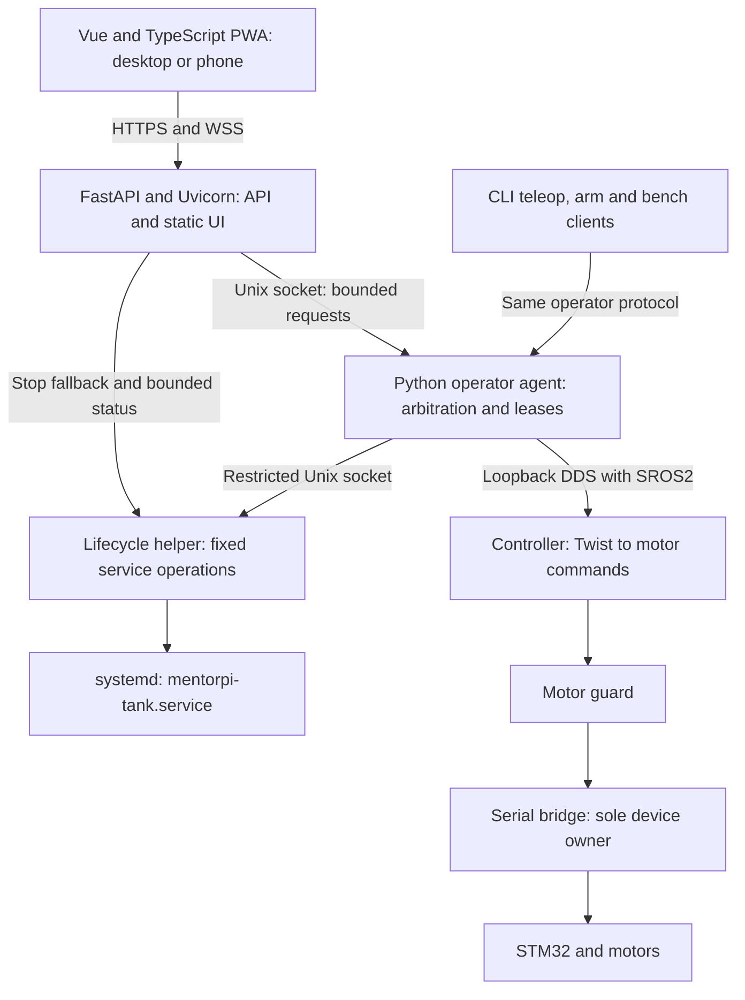

# MentorPi Pi 5 Web Control Design

Status: Milestone 10 completed; Milestones 11–16 pending implementation.

Date: 2026-09-15

Target: Native Ubuntu 26.04 ARM64 / ROS 2 Lyrical on the MentorPi Tank Pi 5.

## 1. Purpose and relationship to the native controller

Provide a page served by the Pi that the owner can open from a laptop, desktop,
or phone on the local network to start and stop the controller, arm and disarm,
drive forward/reverse, spin left/right, and inspect status and recent logs.
Driving supports both on-screen buttons and W/S/A/D; Space stops motion.

Selected stack: Vue 3 + TypeScript + Vite PWA frontend, Python FastAPI served
by Uvicorn, and a separate Python operator agent connected over a Unix socket.
The PWA provides the future phone controller using the same API and control
rules as the desktop page. Python permits reuse of configuration, validation,
and supporting libraries without combining web serving with motor supervision.

This extends [the native controller design](MENTORPI_FRESH_CONTROLLER_DESIGN.md).
Reuse its controller, motor guard, serial bridge, kinematics, speed enforcement,
loopback DDS configuration, SROS2 enforcement, and immutable release workflow.
The September 14 repository handoff records native raised-track acceptance;
this document does not independently reverify that evidence. Browser, network,
and new process failure paths require their own acceptance before web driving.

This is a native application under `ubuntu_tank/`, not an extension of the
factory observer in `docker/customization/`. Native/factory mutual exclusion
and sole ownership of `/dev/rrc` by the motion service remain mandatory.
Initial operation is raised-track only. This design does not authorize
on-ground motion, remote unattended driving, or operation beyond visual range.

Version 1 includes everyday controller operations, not a browser shell, package
installation, OS reboot, firmware updates, autonomous navigation, or camera and
LiDAR integration. Deployment and instrumented bench acceptance remain CLI tasks.

## 2. Page and operator interaction

Use a responsive single page with large labeled controls, visible keyboard
hints, and status expressed in text as well as color. Keep Stop motion visible
without scrolling. A conceptual layout is:

```text
MentorPi Tank             Connected | Controller running | Disarmed
Battery: 12.2 V           Control owner: this tab | Raised-track mode

[Start controller] [Stop controller] [Take control] [Release control]
[ ] I confirm the tracks are raised and the power disconnect is accessible
[Arm] [Disarm]

                          [Forward W]
                [Left A] [STOP Space] [Right D]
                          [Reverse S]

Hold a direction to move. Release to stop. Space stops and disarms.
Command: zero | Delivery: idle | Last update: 0.1 s ago
[Recent logs] [Diagnostics]
```

Values above are illustrative, not live readings.

| Control | Required behavior |
| --- | --- |
| Start controller | Start `mentorpi-tank.service`; wait for readiness and fresh disarmed state. Starting does not arm or move. |
| Stop controller | Invalidate driving, request zero/disarm, then stop the systemd service even if ROS is unavailable. Keep the web page available. |
| Take control | Acquire the single operator slot while disarmed; report who holds it if busy. Opening a page never takes control automatically. |
| Arm | Require explicit current tracks-raised acknowledgment, ownership, healthy preflight, neutral input, and a ready command path. |
| Forward / W | Hold for positive linear velocity, zero angular velocity. |
| Reverse / S | Hold for negative linear velocity, zero angular velocity. |
| Left / A | Hold for positive angular velocity (spin left), zero linear velocity. |
| Right / D | Hold for negative angular velocity (spin right), zero linear velocity. |
| Direction release | Immediately request zero. Remain armed only while the active control session is healthy and within its idle limit. |
| Stop motion / Space / Disarm | Request zero and disarm; clear all held input and require a new explicit Arm before moving again. No confirmation dialog. |
| Release control | Stop, disarm, invalidate the control lease, and relinquish ownership. |

On-screen movement uses press-and-hold: a quick click produces only a brief
request between press and release, possibly no visible movement. It never
latches motion after a click. Do not add a minimum movement duration to make a
quick click visible. Default web speeds are 0.20 m/s linear and 0.50 rad/s angular;
version 1 has no speed slider. Server configuration may reduce them, never
exceed the installed controller limits or accepted motor RPS caps.

Keyboard driving activates only after taking control and explicitly focusing
the drive panel. Use `KeyboardEvent.code` (`KeyW`, `KeyS`, `KeyA`, `KeyD`) and
keydown/keyup state; OS key-repeat is not required for continuous holding.
Ignore direction shortcuts in text inputs, editable content, dialogs, or with
Ctrl/Alt/Meta modifiers. Space has stop priority whenever this page has focus,
including its text fields; it cannot be a global shortcut in another window.
Prevent browser scrolling only for handled controls. No key held before Arm may
start motion: require release and a new press.

Exactly one direction/input source is valid at once. Multiple direction keys,
multiple touches, or mixed pointer/keyboard driving request zero and require
all inputs to be released before another direction can start. No diagonal or
combined commands in version 1. Direction reversal passes through zero.

Use pointer capture, and handle `pointerup`, `pointercancel`, and
`lostpointercapture`; cancel when the pointer leaves the drive button bounds.
Suppress compatibility click events that could duplicate a press. Use semantic
buttons and accessible focus styling; keyboard-only users drive with W/S/A/D.
[MDN documents the pointer event and capture lifecycle](https://developer.mozilla.org/en-US/docs/Web/API/Pointer_events).

Window blur, hidden document, navigation, screen lock, or socket loss clears
input and requests stop/disarm. Returning to the page never resumes movement.
Lifecycle notifications are best effort; the Pi enforces expiry independently.
Hidden-page timers may be throttled, so they cannot supply safety timing.
[Page Visibility API behavior](https://developer.mozilla.org/en-US/docs/Web/API/Page_Visibility_API).

## 3. Process architecture and ownership



### 3.1 Web service

New `mentorpi-tank-web.service`, non-root user `ubuntu-tank-web`, serves bundled
compiled Vue assets and an HTTPS JSON/WebSocket API. Use Python FastAPI with
Pydantic request/response models and one Uvicorn worker managed by systemd.
Disable development reload in production. Uvicorn terminates HTTPS using the
configured certificate; a separate proxy is not required for this deployment.
Lock and verify the native dependency closure before implementation is accepted.
[FastAPI features](https://fastapi.tiangolo.com/features/) and
[server deployment](https://fastapi.tiangolo.com/deployment/manually/).

Use strict validation for safety fields, including booleans, bounded numbers,
enums, and rejection of unexpected fields. Publish versioned OpenAPI for HTTP
routes and generate the frontend HTTP client/types from it. WebSocket messages
need explicit runtime validation and separate versioned JSON schemas and
TypeScript types; they are not automatically described by HTTP OpenAPI.
Serve API documentation assets locally, or disable the
interactive docs in production; no runtime CDN dependency.

The web process has no ROS credentials, serial access, general sudo permission,
or writable release files. It forwards explicit input; it must never regenerate
motion renewals from its last received direction. A stalled web event loop must
cause the independent operator agent to expire motion.

### 3.2 Operator agent

New `mentorpi-tank-operator.service`, a separate Python process under a non-root
dedicated user, owns the sole
authorized operator publisher to `/controller/cmd_vel` and guard arm client.
It uses the existing packaged loopback discovery profile and enforced security.
It has no serial access and retains localhost-only network confinement.
The controller/guard/bridge path and its independent watchdogs remain intact.

Share side-effect-free Python schemas and configuration utilities where useful.
The web process must not import modules that initialize ROS, open hardware, or
start publishers. All control requests cross the authenticated Unix socket;
using the same language does not remove this process boundary.

Use a bounded, versioned Unix-socket protocol with peer credential checks for
the web service and authorized local operator accounts. The agent owns all
monotonic deadlines, command mapping, fresh preflight, control arbitration,
periodic ROS publishing, and state reporting. Socket handlers and ROS service
calls must not block its deadline checks. No nonzero publisher may continue
running in another thread from a cached command without checking its deadline.

Migrate CLI teleop, arm/disarm, and bench command submission to this same agent;
read-only clients may retain their status enclave. This is required integration
work, not an assumption that the existing CLI already serializes publishers.
Provision operator keys for the agent only and retire legacy direct-publisher
credentials when web control is enabled. SROS2 policy and actual key filesystem
access must agree. Preserve bench correlation and terminating-zero observations.
Root/owner intervention remains trusted, as in the native controller design.

One connection holds control, including across browsers, tabs, CLI teleop, and
bench. No silent takeover. Handoff requires stop/disarm confirmation or service
stop before granting another owner. Any connected client may request
Stop/Disarm even if another tab owns driving. Stop invalidates the old motion
generation before replying so subsequent queued commands cannot restart it.

### 3.3 Lifecycle helper

A small root-owned helper exposes only fixed `start`, `stop`, `status`, and
bounded recent-log operations for `mentorpi-tank.service` over a protected Unix
socket. Use fixed argument arrays and sanitized environment, never shell text,
caller-selected unit names, file paths, or arbitrary arguments. Check peer
credentials and request sizes. The web peer may request stop/status/logs directly
when the operator agent is unavailable; start requires agent coordination.

Extract and reuse installed native preflight/lifecycle logic instead of invoking
a mutable checkout's `deploy.sh` or blindly calling `systemctl start` without
preflight. Serialize starts and release changes under the deployment lock.
Activation must revoke control and stop the graph before switching releases;
reject starts while activation/recovery is pending. Stop must not wait behind
a long build/deployment lock or an unavailable ROS response. Define lock ordering
and bounded cancellation explicitly in implementation tests.

The web and operator services remain available with the motion service stopped;
they must not have a dependency that starts the motor service just to display
the page. Starting any new service leaves ownership empty and motion disabled.
Lifecycle operation completion means observed systemd state, not subprocess
launch success. Report stop failure as unconfirmed, never as physical rest.

### 3.4 Vue frontend and PWA lifecycle

Use Vue 3 single-file components, TypeScript, Vite, and `vite-plugin-pwa`.
Start with one responsive page and simple component/composable state; add routing
or a state-management library only when screens require it. Separate input
handling, API transport, telemetry, and rendering. Keep one connection/input
controller per active page and clean it up on component unmount.
[Vue introduction](https://vuejs.org/guide/introduction.html) and
[Vite PWA guide](https://vite-pwa-org.netlify.app/guide/).

Build on the workstation or build host and package the static output with the
backend. The Pi serves those files without a Node.js server or frontend build
tools at runtime. A web app manifest defines the name, icons, start URL, scope,
and standalone display. Use the same stable HTTPS origin for installation,
API calls and WSS; document certificate trust on phones.

The service worker caches only versioned interface assets. Exclude `/api/`,
telemetry and control requests from caching and background
sync; never persist or replay commands. The interface can open while the Pi is
unreachable, but must show disconnected status with driving disabled and no
cached battery/armed state presented as live. Internet access is unnecessary
when the phone can reach the Pi over the local network.

Use an explicit update prompt, not automatic page reload or forced service-worker
activation during control. Stop/disarm and relinquish ownership before accepting
an update. Every freshly loaded or resumed client checks backend protocol and
release compatibility before acquiring control; an incompatible cached client
remains unable to arm. Backend checks must reject incompatible clients too.
Rollback must work even when a phone retains newer cached assets: incompatible
clients can reload the installed UI, but cannot regain control through stale
sessions. Network-only recovery/version endpoints remain reachable outside the
cached app shell.

The service worker is not a motion publisher or a timer for renewing leases.
Phone lock, app switching, suspension, and loss of focus follow the existing
stop/expiry rules. Resume requires fresh state and explicit control acquisition
and arm. Validate installation and lifecycle behavior on actual Android/iOS
devices; desktop emulation alone does not establish mobile acceptance.
[Service worker lifecycle and HTTPS requirements](https://developer.mozilla.org/en-US/docs/Web/API/Service_Worker_API).

## 4. Motion lease and state contract

Application states are `NO_OWNER`, `OWNED_DISARMED`, `ARMING`, `ARMED_IDLE`,
`DRIVING`, and `FAULT`. Service state and telemetry freshness are separate fields.
Only `ARMED_IDLE`/`DRIVING` accept nonzero intent. Any fault, control-lease expiry,
service restart, agent restart, or changed release invalidates the control epoch
and requires explicit acquisition/arming as appropriate.

1. Acquire ownership while disarmed. Resolve one installed release and prepare
   ROS discovery/subscriptions before enabling Arm.
2. Arm only with fresh guard/bridge health, valid battery and hardware preflight,
   no conflicting stack or operator, and neutral browser input. Reuse native
   preflight thresholds; missing or stale information blocks arming.
3. After successful arm, submit fresh zero immediately within the existing
   250 ms first-command deadline. Confirm guard state and downstream zero
   delivery before enabling direction controls. Timeout or a late arm response
   triggers compensating disarm; never trust a timed-out arm request to have
   had no effect. Repeated Arm cannot renew a deadline.
4. Publish at 20 Hz only from currently valid agent state. Active sessions send
   explicit neutral intent while idle; zero publishing ends with disarm after
   30 seconds without directional input. Status polling does not count as input.
5. A motion/session lease lasts at most 150 ms, checked at least every 20 ms.
   Expiry immediately clears nonzero state, requests repeated zero/disarm, and
   invalidates that epoch. The existing 250 ms guard/bridge freshness behavior
   remains an independent fallback if the agent stalls or crashes.

To bound delayed commands, the agent issues single-use challenges every 50 ms
with an unpredictable token, current epoch, and a deadline 150 ms after issuance
on the Pi monotonic clock. The focused browser returns its current neutral or
held direction with the challenge and increasing sequence number. A response
cannot extend the lease past that challenge's original deadline. Reject expired,
reused, out-of-order, wrong-owner, or old-epoch responses; browser wall clocks
are never authoritative. Once expired, an epoch cannot be revived by late input.
The web layer only relays these challenges and responses.

Use latest-intent handling with bounded queues, not queued movement playback.
Stop has priority over nonzero intent and invalidates outstanding challenges.
Allow at most one unsent intent per connection; close a congested control socket
and expire ownership instead of draining buffered motion later. The browser
WebSocket API lacks automatic backpressure, so queue limits must be explicit.
[WebSocket API constraints](https://developer.mozilla.org/en-US/docs/Web/API/WebSocket).

As a version-1 additional limit, cap a continuous hold at 5 seconds, then stop
and disarm. A new explicit arm and fresh press are required. Browser code cannot
prove that a human is still physically holding a key when input events are lost;
this cap limits that failure without treating a network heartbeat as proof of
human intent. Do not extend any safety deadline to hide poor Wi-Fi performance.

An explicit stop requests zero without waiting for the next publication tick.
Healthy-agent zero submission target is within 20 ms of receipt or lease expiry;
150 ms plus a 20 ms scheduling check is a software target, not a measured physical
stop guarantee. Browser-to-Pi delay and actual track deceleration are separately
measured. Space is a software stop, not a replacement for the physical disconnect.

## 5. Network access and API

This is a personal, single-owner tank on a trusted local network. The web UI
and API require no user authentication: no login/logout, passwords, accounts,
API keys, bearer tokens, authentication cookies, or login-session store.
Any client that can reach the configured interface can view status and request
control. Take control selects one active connection; it does not identify a user.

Default deployment is HTTPS on a configured LAN address, port 8443; advertise
the actual configured URL in CLI status. Provision an owner-trusted server
certificate for browser/PWA support; no client certificate is required. Serve
all assets locally for operation without Internet access.

Validate the exact Host/Origin on HTTP and WebSocket browser requests; reject
cross-origin mutations and missing-Origin browser controls. Use a restrictive
same-origin CSP, deny framing, and render logs as text. Bound connections,
input sizes, and log responses; control expiry runs independently of request
load. These browser safeguards do not authenticate users. Control ownership,
challenge tokens, epochs, explicit arming, and stop deadlines remain motion
safety mechanisms, with immediate invalidation on connection loss or lease expiry.
Existing native SROS2 and local process-identity checks remain internal controller
safeguards; they add no web login or user-authentication workflow.

| Proposed API | Input, result, and side effect |
| --- | --- |
| `GET /api/v1/status` | Service/agent/guard status, freshness, battery, owner, limits, release ID, and last fault; never arms. |
| `GET /api/v1/version` | Network-only protocol compatibility and release identity; no robot state or credentials. Used before control and to recover incompatible cached clients. |
| `GET /api/v1/logs?limit=N` | Recent controller/web/agent logs, maximum 200 lines and 64 KiB; no arbitrary journal filters. |
| `POST /api/v1/controller/start`, `/stop` | Request ID; return operation ID and pending/completed/error state. Stop invalidates driving first. |
| `POST /api/v1/control/acquire`, `/release` | Connection-bound ownership; acquisition returns epoch or busy, release stops/disarms. |
| `POST /api/v1/control/arm` | Epoch, request ID, exact boolean `tracks_raised: true`; returns pending then confirmed or failed. |
| `POST /api/v1/control/stop` | Stop independent of ownership; immediate invalidation and asynchronous zero/disarm confirmation. |
| `GET /api/v1/operations/{id}` | Status of a bounded retained operation; timeouts/errors explicit. |
| `WSS /api/v1/control` | Control connection binding, agent challenges, enumerated direction/neutral intent, stop, acknowledgments, and live state. |

All mutation requests are bounded JSON with schema version and request ID.
Directions are enums, not arbitrary velocities, ROS topics, or service names.
Reject unexpected fields, invalid booleans/numbers, and oversized frames before
changing state. Use stable errors such as `NOT_OWNER`, `LEASE_EXPIRED`,
`PREFLIGHT_FAILED`, `CONTROLLER_UNAVAILABLE`, and `DEPLOYMENT_BUSY`.
Retries of the same operation ID must not repeat an arm or revive motion.
Never automatically retry nonzero intent or arm after reconnection.

Display service running, guard armed, requested velocity, and observed delivery
as distinct facts. Timestamp telemetry on the Pi and expose its age; historical
transient-local ROS state alone cannot establish current health. Stale telemetry
disables arming/driving and triggers disarm. Define per-topic freshness thresholds
from actual publisher rates during M10. Do not label a successful serial write
as physical movement or show a stopped icon solely because zero was requested.

## 6. Files, installation, and rollback

Proposed source layout:

```text
ubuntu_tank/
  web/src/                        Vue components, TypeScript, generated API types
  web/public/                     PWA icons and other public static assets
  web/package.json                frontend build/test dependencies
  web/package-lock.json           locked frontend dependency graph
  web/vite.config.ts              Vite and PWA cache/update configuration
  web/dist/                       generated static output; ignored, packaged
  src/ubuntu_tank_web/             FastAPI API, static serving and socket client
  src/ubuntu_tank_operator/        ROS agent, leases, arbitration, schemas
  host/mentorpi-tank-web.service
  host/mentorpi-tank-operator.service
  host/mentorpi-tank-lifecycle.*    restricted helper/socket assets
  config/web/                     documented non-secret defaults
  tests/                          protocol, browser, deployment and fault tests
```

Install code with the same immutable release under `/opt/ubuntu_tank`;
configuration and TLS material below `/etc/opt/ubuntu_tank/web`, ephemeral sockets
and sessions below `/run/ubuntu_tank-web`, and bounded persistent diagnostics
below `/var/opt/ubuntu_tank/web`. Split file ownership so only the web service
reads its TLS material and only the agent reads operator ROS keys.
Neither new non-root account joins the serial-access group.

Document `listen_address`, `port`, certificate/key paths, allowed origin,
web speed caps, lease/publication periods,
idle timeout, and maximum hold duration. Reject inconsistent configurations at
startup; browser requests cannot override timing or speed limits. Bind safely
to loopback until LAN address and TLS are configured.

Extend existing package/install/activate/rollback transactions to include new
units, schemas, credentials permissions, and SROS2 migration. Activation stops
all command producers and invalidates sessions; mixed release/protocol versions
fail closed. Never hot-reload a driving process. Rollback to a native-only release
disables the web/agent units and restores matching native CLI/security assets,
leaving the controller stopped and disarmed. Preserve credentials separately
from shipped artifacts and omit secrets from reports.

Workstation Python tooling stays in the repository `.venv`. Target/build-root
Python, FastAPI, Uvicorn, Pydantic, and their transitive dependencies must be
apt/ROS-managed and added to the locked closure. Verify compatible ARM64 packages
in M10; unresolved packaging is a gate, not permission for target pip installs
or nested virtual environments. Lock build-host Node.js/npm and frontend package
versions; use `npm ci`, TypeScript checking, tests, and a production Vite build.
Record frontend and backend identity in the release manifest and include only
required static output in the installed frontend payload, not `node_modules`.
Browser-test tooling is development-only and version-locked. All new commands
and deployment flags are proposed until implemented and documented in README.

## 7. Trackable implementation milestones

Continue numbering after native Milestone 9. All boxes below are initially open.
Implement M10 through M16 in order; M12 and M13 can proceed independently after
M11's protocol is stable, with M14 integrating both.

### Milestone 10 — Protocol, state machine, and dependency closure

- [x] Define versioned schemas, state transitions, monotonic challenge deadlines,
  error codes, telemetry freshness, configuration validation, and lock ordering.
- [x] Lock native web dependencies and document exact release/API compatibility.
- [x] Verify FastAPI/Uvicorn/Pydantic ARM64 apt closure; lock Vue/TypeScript/Vite
  and PWA build dependencies and define HTTP/OpenAPI and WebSocket schemas.
- [x] Add deterministic tests for expiry, late/replayed intent, stop priority,
  arm cancellation, stale state, idle timeout, and the continuous-hold cap.

Exit: hardware-free tests prove no stale input can create or revive motion.
Status: Completed. Hardware-free deterministic test suite passes 100% across all
monotonic challenge lease, 5.0 s continuous hold, 30.0 s idle timeout, stop priority,
arm cancellation, and telemetry freshness gates.

### Milestone 11 — Shared operator agent and CLI integration

- [ ] Implement the loopback-only ROS operator agent and credential-checked IPC.
- [ ] Route teleop, arm/disarm, and bench through exclusive ownership; migrate
  SROS2 permissions/key access and preserve read-only diagnostics.
- [ ] Verify first-command zero, delivery correlation, fault recovery, agent
  crash behavior, and rejection of competing direct publishers.

Exit: native middleware tests show exactly one command authority and working CLI
regressions. Hardware-free evidence remains distinct from target-Pi evidence.

### Milestone 12 — Web API and service lifecycle

- [ ] Remove M10 login/logout schemas and exports, authentication error codes,
  credential-file/login-session configuration, and matching OpenAPI generator,
  generated specification, and TypeScript types. Retain connection identifiers,
  motion challenges, and leases for control arbitration; they are not login sessions.
- [ ] Implement TLS provisioning, same-origin controls, bounded HTTP/WSS,
  agent challenge relay, status, logs, and operation results.
- [ ] Implement FastAPI strict models, OpenAPI export, WebSocket validation,
  compatibility/version endpoint, and the single-worker Uvicorn systemd service.
- [ ] Implement the narrow lifecycle helper and start/stop deployment interlocks.
- [ ] Test cross-origin requests, oversized messages, request
  floods, frozen web process, and Stop when the agent or ROS is unavailable.

Exit: the page manages a mocked service without login or root web privileges;
only the active control owner can arm/drive, any client can stop, and queue
congestion cannot prolong an agent lease.

### Milestone 13 — Vue browser and PWA driving interface

- [ ] Implement the page, hold buttons, W/S/A/D, Space, acknowledgments, status,
  ownership display, responsive layout, and accessible focus behavior.
- [ ] Automate browser tests for key release, focus loss, hidden tabs, pointer
  cancellation, mixed inputs, held keys across Arm, delayed messages, multiple
  tabs, connection loss, and reconnection with no automatic resume.
- [ ] Verify fresh neutral intent while idle and immediate local input clearing.
- [ ] Build Vue/TypeScript components and the generated HTTP API client; add
  manifest/icons, asset-only caching, explicit updates, and offline status.
- [ ] Test that offline requests cannot queue/replay movement, updates require
  disarm, and stale or incompatible cached clients cannot arm.

Exit: real browser tests against a mocked agent satisfy every interaction in §2.

### Milestone 14 — Installed Pi integration and rollback

- [ ] Package all services/assets; verify ARM64 imports, dependency closure,
  ownership, TLS trust setup, and production systemd confinement on the Pi.
- [ ] Verify installed native DDS delivery without motor power, CLI/browser
  exclusion, web availability while the controller is stopped, and safe restart.
- [ ] Test activation, interrupted activation, incompatible protocols, and
  rollback to native-only releases without retained sessions or motion.
- [ ] Verify packaged static frontend delivery without Node.js at runtime,
  phone-trusted HTTPS, PWA installation, and cached-client recovery on rollback.

Exit: reproducible target-Pi installation and recovery pass; motion gates remain
blocked until raised-track testing is explicitly undertaken.

### Milestone 15 — Raised-track web movement and failure acceptance

- [ ] Observe all four directions via buttons and keyboard at conservative speed;
  verify release, Space, Disarm, Stop controller, idle timeout, and hold cap.
- [ ] Measure loss-of-focus, tab close, browser crash, Wi-Fi loss, delayed/buffered
  packets, web crash/hang, operator crash/hang, and reconnect behavior.
- [ ] Repeat relevant controls and failure cases in installed Android/iOS PWAs,
  including touch cancellation, app switching, screen lock, resume, and updates.
- [ ] Re-run affected native guard/bridge/serial/host-stop acceptance cases; a
  previous native acceptance report does not certify the new producer path.
- [ ] Record exact installed release, configuration, client/browser versions,
  network conditions, physical observer, instruments, and raw evidence.

Target: physical rest within 300 ms for browser/network/web loss with a healthy
agent, measured from the injected fault; record event-to-agent, zero-write, and
physical-stop timing separately. Agent and downstream failures must also satisfy
the applicable native measured bounds. These are acceptance targets, not current
claims. If measurements fail, keep the gate open; do not silently raise limits.

Exit: actual track observations and instrumented timings pass. Mocks, request
acknowledgments, and serial writes alone cannot mark physical acceptance passed.

### Milestone 16 — Operator handoff and release

- [ ] Document certificate setup and direct page access, normal start/arm/drive/stop flow,
  input limitations, loss-of-connection recovery, CLI handoff, and rollback.
- [ ] Document phone installation, tested browser/OS versions, offline behavior,
  update/recovery workflow, API schemas, and frontend build commands.
- [ ] Publish a web-specific acceptance report with separate software, installed
  Pi, and physical results, and links to reproducible evidence.
- [ ] Obtain an independent committed-code review and resolve critical findings;
  record the accepted release and remaining operational restrictions.

Exit: the owner can perform everyday controls entirely from the page, with
bounded motion, verified stopping, and a documented local recovery path.

## 8. Definition of done

An installed Pi serves the Vue/TypeScript PWA through FastAPI/Uvicorn without an
Internet dependency or a Node.js runtime. Mobile installation, offline status,
disarmed updates, and cached-client compatibility/recovery pass their gates;
start/stop, arm/disarm, mouse/touch buttons, W/S/A/D, and Space work as specified.
Only one operator controls motion, loss of input or connectivity cannot latch
movement, reconnection never resumes it, and production DDS/security confinement
remains effective. M10–M16 evidence is complete and distinguishable from native
M1–M9 evidence. Raised-track completion still does not authorize on-ground use.
